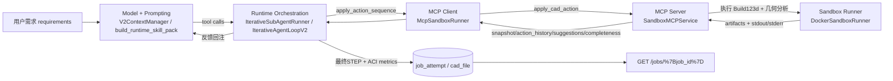
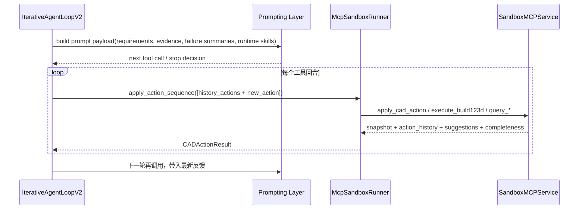
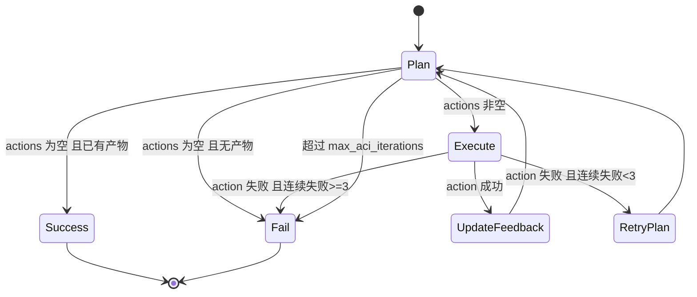

# CAD ACI 系统设计说明

> Canonical policy notice:
> The normative, agent-readable system record now lives in `docs/cad_iteration/`.
> Start from `docs/cad_iteration/INDEX.md` and treat this document as the historical design narrative.

> 2026-04-21 cleanup note:
> The old `src/sub_agent/*` planner/codegen chain has been removed.
> Any earlier planner/codegen wording in this narrative should be read as historical background only.
> The live runtime surface is `sub_agent_runtime` (`orchestration`, `prompting`, `tooling`, `semantic_kernel`).
>
> 2026-04-21 consolidation note:
> Internal package growth is now frozen at those four subdomains plus the existing second-level package surfaces.
> The active engineering rule is to push behavior into the current owner modules instead of creating new facade layers around `shared.py`, `batch.py`, `skill_assembly.py`, or `context_builder.py`.
> The current live phase is **hotspot deconcentration inside a frozen structure**: keep moving lane helpers into `policy/*`, move lint ownership into `tooling/lint/{families,ast_utils,routing,recipes}`, and keep `prompting` changes limited to owner cleanup rather than new package growth.
> The execution package surface has also been narrowed: `tooling.execution.__init__` is now only the ToolRuntime/generic-helper surface, while plane-family heuristics and named-plane helpers live in `tooling/lint/families/planes.py`.
> Recent orchestration owner migrations moved sketch-window continuation helpers into `policy/local_finish.py`, auto-validation/result helpers into `policy/validation.py`, repair/failure-cluster helpers into `policy/code_repair.py`, and semantic-refresh lookback helpers into `policy/semantic_refresh.py`, leaving `policy/shared.py` as the loop shell plus cross-lane shared utilities.
> The default Kimi reasoning model is now `kimi-k2.6`; it currently follows the same non-thinking provider path as `kimi-k2.5`, with `kimi-k2.6-thinking` reserved for a later switch.

本文的1-2节给出了概要，3-7节描述了当前实现的简化设计，8-10节给出了未来急需的实现方向，大多数是关于反馈机制，由于目前对CAD的认知还不够全面，这部分仍需和专家进一步调研论证。

> 2026-03-10 增量说明（规范以 `docs/cad_iteration/` 为准）：
> 当前执行环路已支持 inspection-only 回合（`actions=[] + inspection`），并引入“search -> window -> inspect -> act”证据检索模式，用于控制 prompt 体积并提升局部几何可见度。

## 1. 文档目标

本文重点回答四个问题：

1. LLM 如何理解当前 CAD 模型状态，并据此做动作决策。
2. ACI 给 LLM/执行器提供了哪些“可操作工具”，这些工具如何设计。
3. 各模块在代码中的职责、数据契约、控制流如何协同。
4. 在当前实现基础上，下一阶段应如何演进（反馈设计、多模态、交互界面、工具能力）。

## 2. 总体架构

ACI 的核心是“动作规划 + 执行反馈 + 再规划”的闭环，不是一次性生成完整 Build123d 脚本。

## 3. 当前LLM 如何“理解 CAD 模型”

### 3.1 几何反馈是如何产生的

几何反馈由 sandbox 执行后的结构化产物生成：

1. `SandboxMCPService._rebuild_model_code()` 会在动作回放后附加几何分析代码。
2. 分析代码会写出 `/output/geometry_info.json`，包含 `solids/faces/edges/volume/bbox/center`。
3. `DockerSandboxRunner` 将 `geometry_info.json` 作为 artifact 回传。
4. `SandboxMCPService._parse_snapshot()` 读取 `geometry_info.json`，构造 `CADStateSnapshot.geometry`。
5. `SandboxMCPService._generate_suggestions()` 结合几何值与动作类型给出下一步建议。
6. `SandboxMCPService._generate_completeness()` 基于历史动作和快照，产出完成度信号。

目前LLM 不是直接看 CAD 内核对象，而是看“执行后提炼出的结构化状态”。

### 3.2 反馈链路如何进入 LLM

反馈进入 LLM 的路径是固定且可追踪的：

1. `apply_cad_action` 返回 `action_history/suggestions/completeness`。
2. `McpSandboxRunner` 将结构化 payload 映射为 `CADActionResult`。
3. `IterativeAgentLoopV2` 更新本轮状态。
4. 下一轮由 `V2ContextManager.build_prompt_payload()` 和 `build_runtime_skill_pack()` 把这些字段写入模型可见上下文。

### 3.3 当前反馈信号的性质

当前反馈仅为简化实现，以“规则推导 + 几何统计”为主，具有以下特点：

1. 可解释：每个字段来源明确。
2. 成本低：无需额外视觉模型。
3. 粗粒度：还不足以表达“哪条边、哪个面需要改”。

这也是后续多模态与细粒度反馈要解决的问题，未来的解决方案可见第9节。

## 4. ACI 的“工具面”设计

### 4.1 MCP Server 暴露的工具

`services/sandbox/mcp_server/src/sandbox_mcp_server/server.py` 当前注册了 3 个工具：

1. `execute_build123d`
2. `apply_cad_action`
3. `get_history`

### 4.2 工具能力矩阵

| 工具 | 主要用途 | 输入 | 核心输出 | 状态语义 |
|---|---|---|---|---|
| `execute_build123d` | 执行完整 Build123d 代码 | `code`, `timeout_seconds`, `include_artifact_content` | `output_files`, `artifacts`, `evaluation` | 无会话状态 |
| `apply_cad_action` | 执行单个 CAD 动作并返回诊断 | `action_type`, `action_params`, `session_id` | `snapshot`, `action_history`, `suggestions`, `completeness` | 有会话状态 |
| `get_history` | 查询会话动作历史 | `session_id`, `include_history` | `action_history` | 只读会话状态 |

### 4.3 当前 runtime 实际采用的工具路径

虽然 MCP 暴露了 3 个基础工具，但当前 runtime 主路径主要使用：

1. 运行时通过模型工具调用或兼容 envelope 驱动下一步 tool choice，不再依赖旧的 planner-only JSON 输出。
2. tool orchestration 通过 `apply_action_sequence()` / tool runtime dispatch 调用 `execute_build123d`、`apply_cad_action`、`query_*`。
3. `get_history` 仍是只读辅助工具，不承担主循环规划职责。

## 5. 核心模块详细设计

### 5.1 Prompt 层：`sub_agent_runtime/prompting/*`

目标：把模型约束在“当前证据 + 当前工具面”的 runtime prompt 内，而不是依赖旧 planner 的单一系统 prompt 文件。

关键约束：

1. prompt payload 由 `V2ContextManager` 负责拼装。
2. 运行时技能和 repair guidance 由 `prompting.skill_assembly` 负责主装配，requirement detectors / failure logic 落在 `prompting.requirements` 与 `prompting.failures`。
3. 旧 prompt 资源不再是 live entrypoint；Build123d contract 由 active prompting/tests/docs 共同维护。
4. 模型必须利用 `action_history/suggestions/completeness` 以及 fresh validation / domain-kernel evidence。
5. requirement detectors / failure classification / diagnostics inclusion 已拆到 `prompting.requirements`、`prompting.failures`、`prompting.diagnostics_policy`。

### 5.2 编排层：`sub_agent_runtime/orchestration/*`

关键实现点：

1. `IterativeSubAgentRunner` 维持外部 contract 与 artifact layout。
2. `IterativeAgentLoopV2` 仍由 `orchestration.policy.shared` 承担 loop shell，但 sketch-window、auto-validation、repair/failure-cluster、semantic-refresh lookback 等 helper 已迁回各自 owner module。
3. turn policy、runtime guidance、validation lane 与 local-finish lane 在 `orchestration.policy.{code_repair,semantic_refresh,local_finish,validation,shared}` 协作完成；新增 lane logic 默认进入对应 owner module，不再继续堆回 `shared.py`。
4. 对外 CLI 与 request/result contract 保持稳定。

### 5.3 Tool 执行层：`sub_agent_runtime/tooling/*`

tool runtime 负责 catalog、dispatch、result mapping、preflight lint 与 runtime-owned adapters。真实执行面位于 `tooling.execution.*`，lint 路由和 family surface 位于 `tooling.lint.*`。当前阶段默认继续把执行 helper、lint routing、family detector 往这些 owner 模块收口，而不是再造新 facade。当前 live owner map:

1. `tooling.execution.batch` 只保留 ToolRuntime 主执行、batch orchestration、result fan-in/fan-out 与 write normalization。
2. `tooling.execution.__init__` 只保留执行层 package surface 与 generic helper re-export，不再承接 lint family detector。
3. `tooling.lint.preflight` 只保留 lint orchestration 和结果组装。
4. `tooling.lint.families.builders`、`tooling.lint.families.planes`、`tooling.lint.families.structural`、`tooling.lint.families.keywords`、`tooling.lint.families.path_profiles`、`tooling.lint.families.countersinks` 承接 rule-family 实现。
5. `tooling.lint.ast_utils` 承接 AST helper 与通用 build-context helper。

状态机仍遵循 plan -> act -> inspect -> validate 的循环：

实现要点：

1. 执行器维护 `executed_actions/action_history/suggestions/completeness/repair_error`。
2. 每次执行新动作时，调用 `apply_action_sequence([*executed_actions, action])`。
3. 成功后更新反馈并继续；失败时将错误注入 `previous_error` 触发修复规划。
4. 成功 attempt 会把 ACI 元数据写入 `job_attempt.metrics`。

### 5.4 MCP 客户端层：`libs/sandbox/mcp_runner.py`

此层解决两个问题：

1. 把 MCP `structuredContent` 映射为强类型 `CADActionResult`。
2. 提供 `apply_action_sequence()`，保证同一 stdio 会话中顺序执行动作。

为什么要 `apply_action_sequence`：

1. 单动作调用可能在多进程/多次启动中导致状态不连续。
2. 序列调用可在一次连接里完整重放，减少“会话丢失”风险。

### 5.5 MCP 服务层：`sandbox_mcp_server/service.py`

此层是“动作语义 -> Build123d 执行 -> 反馈结构化”的核心。

主要职责：

1. 会话状态管理（`SessionManager`）。
2. 动作历史回放并重建模型代码（`_rebuild_model_code`）。
3. 动作到代码映射（`_action_to_code`）。
4. 快照解析（`_parse_snapshot`）。
5. 建议与完成度推断（`_generate_suggestions`, `_generate_completeness`）。

## 6. 数据契约（LLM 决策关键字段）

LLM 下一轮决策依赖三类反馈字段：

| 字段 | 来源 | 作用 |
|---|---|---|
| `action_history` | `SessionManager` + `ActionHistoryEntry` | 告诉 LLM 已做过哪些动作及结果 |
| `suggestions` | `_generate_suggestions` | 给出下一步工程建议（可制造性、体积、结构等） |
| `completeness` | `_generate_completeness` | 告诉 LLM 当前完成度、缺失特征、可继续性 |

此外 `snapshot.geometry` 提供数值化几何上下文，避免完全依赖自然语言描述。

## 7. 当前效果与可观测性

当前实现已提供三层可观测性：

1. 执行日志：`aci_action_generation_complete`、`aci_action_failed_retrying_with_feedback` 等事件。
2. API 可见性：`GET /jobs/{job_id}` 返回 `result.aci.*`。
3. 测试产物：可在真实集成测试中落盘 `round_plan/result/model.step/summary`。

这使 LLM 的决策变成可追踪链路。

## 8. 当前实现的边界与技术债

目前实现仅为vibe coding搭建的mvp以论证方案可行性，以下问题来自代码现状，应在文档中明确，不应回避：

1. `_action_to_code` 里部分动作仍是简化实现。
2. `revolve/loft` 等复杂动作分支尚不完整。
3. `rollback/snapshot` 的语义仍偏原型，不是完整参数化时间旅行。
4. `completeness` 主要是启发式规则，尚未做到 requirement-aware 的强约束评估。
5. 通过“全历史重放”保证一致性，长序列下会带来性能开销。
6. `SessionManager` 目前是进程内内存态，不是持久化会话存储。

## 9. 未来演进路线

主要涉及反馈设计、多模态、面向 LLM 的精细查看界面。

### 9.1 阶段一：反馈设计升级（结构化优先）

1. 细化 `completeness`，按 requirement 子目标给出逐项完成率。
2. 引入几何拓扑引用（面/边/特征 ID），减少“建议无法定位实体”的问题。
3. 把错误归因从文本升级为结构化诊断（例如草图闭合失败、布尔失败、选择器失败）。

### 9.2 阶段二：多模态反馈引入（图像 + 结构化融合）

1. 当前已经返回 preview 图片文件名和内容，下一步应把视图语义显式化。
2. 增加多视角固定输出协议（iso/front/right/top 已有基础）。
3. 在 planner 输入中加入“图像摘要特征”字段，而不是只传文件名。
4. 逐步引入视觉模型进行“形状偏差”评估，和几何统计联合决策。

### 9.3 阶段三：LLM 专用建模观察界面

目标是做一个类似“代码代理看文件”的 CAD 观察界面，让模型可精细检查当前状态。

建议能力：

1. 可微调视角与缩放的预览接口（不是固定四张图）。
2. 可查询局部几何（某面法向、某边长度、孔位坐标、壁厚分布）。
3. 可对比上一步与当前步骤差异（几何 diff）。
4. 可将诊断结果回写为结构化上下文给 planner。

## 10. 工具能力扩展建议（面向 LLM）

建议在 `apply_cad_action/get_history` 之外新增一组“查询工具”，避免 planner 盲修：

1. `query_snapshot`：返回指定 step 的快照摘要。
2. `query_geometry`：按实体类型返回尺寸、数量、位置统计。
3. `render_view`：按参数输出自定义视角图像。
4. `validate_requirement`：对照需求返回逐条通过/失败及证据。

这些工具可让 LLM 从“猜测几何状态”升级为“查询几何状态后决策”。

## 11. 实施优先级建议

如果要在近期迭代里最大化收益，建议优先顺序：

1. 先做结构化反馈升级（低风险、直接提升规划质量）。
2. 再做查询类工具（提升可诊断性和可修复性）。
3. 最后做多模态与交互界面（投入大，但上限最高）。

## 12. 小结

ACI 的本质不是“把 Build123d 拆成小步骤”，而是构建一套可迭代、可解释、可诊断的建模决策系统。当前版本已具备闭环骨架：

1. 有动作级工具接口。
2. 有结构化几何反馈。
3. 有执行-反馈-再规划循环。

下一阶段的核心任务，是把反馈从“可用”推进到“高分辨率可决策”，并为 LLM 提供更像工程师实际工作台的观察与验证能力。
