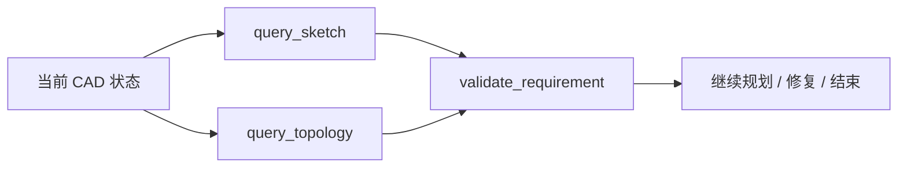
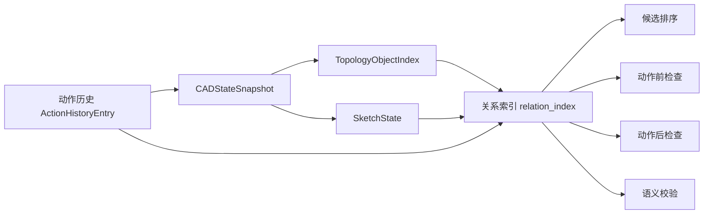
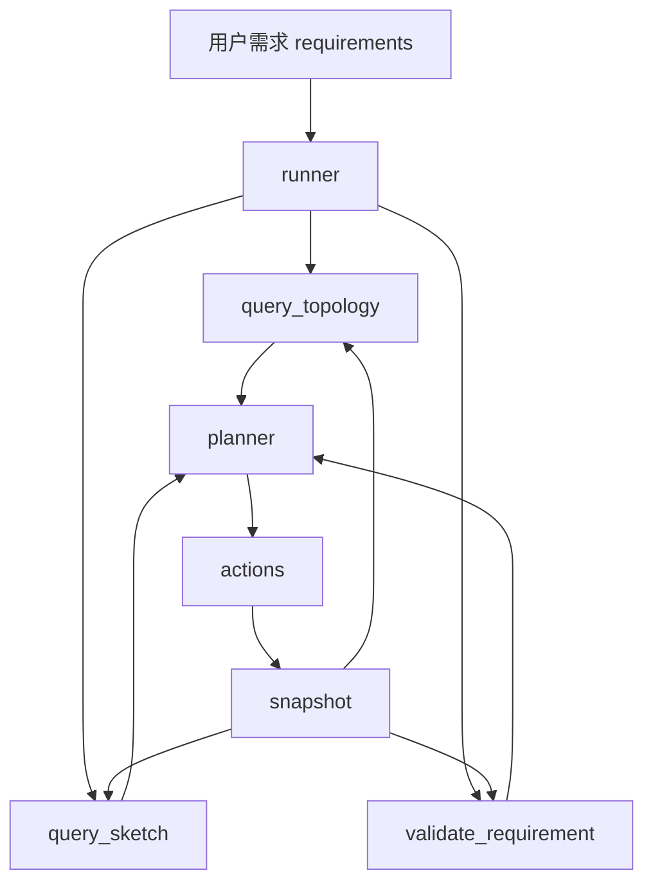
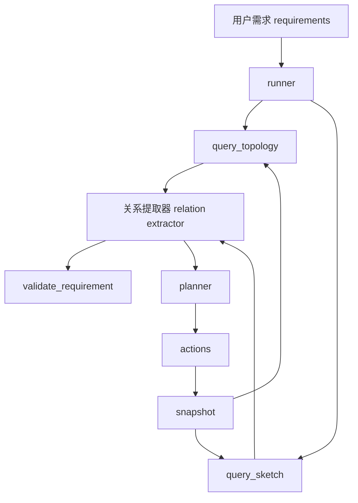
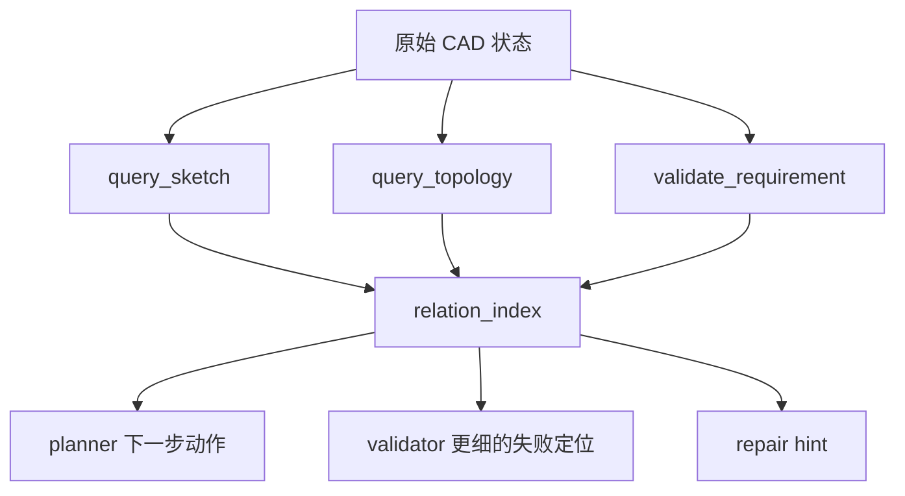

# 2026-03-25 CAD 反馈结构与关系函数调研报告

## 0. 这份报告怎么读

这份报告是为了回答一个很具体的问题：

> 除了现在这种 `query_topology / query_sketch / validate_requirement` 反馈方式，我们还能不能给大模型一种更像 CAD 底层数据结构的反馈，让它更知道自己下一步该做什么？

为了让不做这个项目的人也能读懂，我会先用具体零件举例，再讲数据结构；为了让做这个项目的人能直接定位落点，我会把当前仓库对应的文件、类、函数一起写清楚。

阅读建议：

1. 只想先抓住大意，先看第 1、2、3、6、9 节。
2. 想知道当前代码里已经有什么，看第 4、5 节。
3. 想知道该怎么落地实现，看第 7、8、10 节。

## 1. 一句话结论

最值得补的，不是再多一个“几何查询工具”，而是补一层统一的“关系状态”（下文统一叫“关系层”，英文只在必要时写成 `relation layer`）。

这层关系层的作用是：

1. 把“有哪些面、哪些边、哪些草图”进一步变成“它们之间是什么关系”。
2. 把“关系是否成立”进一步变成“关系成立到什么程度”的数值分数。
3. 让大模型少看散乱几何事实，多看一组更接近 CAD 设计意图的关系状态。

如果只看当前项目，最合适的路线不是重做一个完整 CAD 内核，而是：

1. 保留现有 `query_topology`、`query_sketch`、`validate_requirement`。
2. 在它们之上新增统一的关系层。
3. 先做 10 到 12 个最常用的关系函数。
4. 用这些函数服务于：
   - 选面 / 选边
   - 动作前检查
   - 动作后检查
   - 语义校验

## 1.5 先把当前三种反馈方式讲清楚

在谈新方案之前，必须先把当前系统已经有的 3 种反馈方式讲清楚：

1. `query_topology`
   - 中文可以理解成“查后实体拓扑结构”
   - 重点回答：现在有哪些面和边，它们怎么相邻，哪些像是目标候选
2. `query_sketch`
   - 中文可以理解成“查 pre-solid 草图/路径/截面状态”
   - 重点回答：路径和截面现在长什么样，能不能继续做 `sweep / loft`
3. `validate_requirement`
   - 中文可以理解成“对照需求做语义校验”
   - 重点回答：现在这个零件是否已经满足需求，哪里还没满足

它们三个并不是重复的，而是各管一段：



可以粗暴理解成：

1. `query_sketch` 负责看“草图阶段有没有画对”
2. `query_topology` 负责看“实体出来以后有没有选对地方”
3. `validate_requirement` 负责看“最终是不是满足需求”

### 1.5.1 `query_topology`：它现在到底做了什么

#### 它的实现入口在哪里

实现入口在：

- [`src/sandbox_mcp_server/service.py`](../../src/sandbox_mcp_server/service.py)

关键函数：

1. `query_topology(...)`
2. `_slice_topology_object_index(...)`

对应的数据结构在：

- [`src/sandbox_mcp_server/contracts.py`](../../src/sandbox_mcp_server/contracts.py)

关键类：

1. `TopologyFaceEntity`
2. `TopologyEdgeEntity`
3. `TopologyObjectIndex`
4. `TopologyCandidateSet`

#### 它回答什么问题

它主要回答两类问题：

1. 纯结构问题
   - 当前有哪些 face / edge
   - 它们的类型、中心、法向、包围盒是什么
   - face 和 edge 怎么相邻
2. 规划问题
   - 如果需求说“顶面”“外边”“底部平行于 Y 轴的边”，系统能不能先把候选缩小

#### 一个真实例子：顶面盲孔

真实 case 目录：

- [`test_runs/20260320_174603`](../../test_runs/20260320_174603)

当时需求是：

> 做一个 80x40x20 mm 的长方体，在顶面 `(30, 0)` 位置打一 个直径 10 mm、深 10 mm 的盲孔。

第 2 轮时，planner 没有贸然直接打孔，而是先请求 `query_topology` 来确认“顶面是谁”。

真实 plan 里写的是：

```json
{
  "actions": [],
  "inspection": {
    "query_topology": {
      "include_faces": true,
      "max_items_per_type": 6
    }
  },
  "planner_note": "Identify top face reference to place the blind hole accurately."
}
```

真实返回片段是：

```json
{
  "resolved_query_topology_options": {
    "selection_hints": [
      "top_faces",
      "top_edges"
    ]
  },
  "topology": {
    "applied_hints": [
      "top_faces",
      "top_edges"
    ],
    "candidate_sets": [
      {
        "candidate_id": "top_faces",
        "label": "Top Faces",
        "ref_ids": [
          "face:3:F_e48b00b874ee"
        ]
      },
      {
        "candidate_id": "top_edges",
        "label": "Top Edges",
        "ref_ids": [
          "edge:3:E_cfb1ef0354d7",
          "edge:3:E_2403362d1b9b",
          "edge:3:E_b758b31c0e66",
          "edge:3:E_0f0fa00c1004"
        ]
      }
    ]
  }
}
```

这段返回很有价值，因为它已经做了两件事：

1. 把“顶面”从一堆 face 里缩成了一个明确候选 `face:3:F_e48b00b874ee`
2. 顺手把“顶边”也缩成了一组候选

这说明 `query_topology` 已经不是简单列出所有 face/edge，而是在做“基于需求语义的候选收缩”。

#### 它的不足是什么

它现在最大的不足不是“不知道拓扑”，而是“知道拓扑但还没把关系说清楚”。

上面这个例子里，它知道：

1. 哪个是顶面
2. 哪些是顶边
3. 这个面的法向和位置

但它还不会直接告诉 planner：

1. `(30, 0)` 这个孔中心在该 face 局部坐标里是否合理
2. 这个孔与主块体中心轴是什么关系
3. 如果将来再来 4 个孔，这 4 个孔能否形成线性/圆周阵列

也就是说，`query_topology` 已经能回答“在哪”，但还不够擅长回答“它们之间是什么关系”。

### 1.5.2 `query_sketch`：它现在到底做了什么

#### 它的实现入口在哪里

实现还是在：

- [`src/sandbox_mcp_server/service.py`](../../src/sandbox_mcp_server/service.py)

核心函数：

1. `_build_sketch_state(...)`
2. `_build_sketch_path_entity(...)`
3. `_build_profile_entities(...)`

对应的数据结构在：

- [`src/sandbox_mcp_server/contracts.py`](../../src/sandbox_mcp_server/contracts.py)

关键类：

1. `SketchPathEntity`
2. `SketchProfileEntity`
3. `SketchState`

#### 它回答什么问题

它主要回答的是 pre-solid 阶段的问题：

1. 路径有没有画对
2. 截面有没有画对
3. 这个截面能不能用于 `sweep`
4. 这一组 profile 能不能用于 `loft`

#### 一个真实例子：L 形空心弯管

真实 case 目录：

- [`test_runs/20260324_153400`](../../test_runs/20260324_153400)

在执行 `sweep` 之前，系统拿到的 `query_sketch` 关键片段如下：

```json
{
  "sketch_state": {
    "path_refs": ["path:5:P_1"],
    "paths": [
      {
        "path_ref": "path:5:P_1",
        "plane": "XY",
        "segment_types": ["line", "tangent_arc", "line"],
        "connected": true,
        "start_tangent": [1.0, 0.0],
        "terminal_tangent": [0.0, 1.0],
        "total_length": 131.41592653589794
      }
    ],
    "plane": "YZ",
    "profile_refs": ["profile:5:PR_1"],
    "profiles": [
      {
        "profile_ref": "profile:5:PR_1",
        "plane": "YZ",
        "closed": true,
        "outer_loop_count": 1,
        "inner_loop_count": 1,
        "nested_relationship": "concentric_frame",
        "centers": [[0.0, 0.0], [0.0, 0.0]]
      }
    ]
  }
}
```

这段信息其实已经很强了。它已经明确告诉系统：

1. 路径由 `直线 -> 相切圆弧 -> 直线` 组成
2. 路径是连通的
3. 路径末端切向是朝 `+Y`
4. 截面是闭合的
5. 截面是“一个外环 + 一个内环”
6. 两个环同心，也就是一个空心圆环

如果没有这些信息，planner 基本不可能稳定做好 sweep。

#### 它的不足是什么

它的不足不是“没有看到路径和截面”，而是：

1. 路径信息和截面信息还是分开的
2. 很多关键关系还只是“事实”，还不是“关系对象”

比如这段 JSON 里，读者需要自己脑补：

1. 这个 profile 实际上是“可用于空心 sweep 的截面”
2. 它和 path 终点局部平面是匹配的
3. 这两件事组合起来意味着“可以做正确的空心弯管”

换句话说：

1. `query_sketch` 已经很接近“关系状态”
2. 但它还没有把这些关系显式提炼出来

### 1.5.3 `validate_requirement`：它现在到底做了什么

#### 它的实现入口在哪里

实现入口还是：

- [`src/sandbox_mcp_server/service.py`](../../src/sandbox_mcp_server/service.py)

关键函数：

1. `validate_requirement(...)`
2. `_build_requirement_checks(...)`

它输出的核心对象是：

1. 一组 `RequirementCheck`
2. 一组 blocker

#### 它回答什么问题

它回答的不是“当前状态长什么样”，而是：

1. 这个状态是否已经满足需求
2. 如果没满足，缺的是哪一类语义

#### 一个真实例子：同一个弯管 case 的最终校验

同样来自：

- [`test_runs/20260324_153400`](../../test_runs/20260324_153400)

最终 `validate_requirement` 的核心片段如下：

```json
{
  "blockers": [],
  "is_complete": true,
  "checks": [
    {
      "check_id": "feature_path_sweep_rail",
      "status": "pass",
      "evidence": "path_ref=path:6:P_1, segment_types=['line', 'tangent_arc', 'line']"
    },
    {
      "check_id": "feature_path_sweep_profile",
      "status": "pass",
      "evidence": "closed profile available"
    },
    {
      "check_id": "feature_path_sweep_frame",
      "status": "pass",
      "evidence": "path-end profile frame found"
    },
    {
      "check_id": "feature_path_sweep_result",
      "status": "pass",
      "evidence": "material_sweep=True, bend_required=True, realized_bend=True, volume=14862.791137315424"
    }
  ]
}
```

这说明当前 validator 已经不是只看：

1. 有没有实体
2. 体积是不是正数

而是已经会看：

1. 路径对不对
2. 截面对不对
3. frame 对不对
4. 结果是不是有弯头语义

#### 它的不足是什么

`validate_requirement` 最大的不足是：

1. 它已经很聪明了
2. 但它还是“很多专门规则拼起来的检查列表”

也就是说，它现在更像：

1. 一个越来越强的 rule engine

而不是：

1. 一个统一消费“关系状态”的通用检查器

这会带来两个问题：

1. 新增一种需求时，经常要再写一条新规则
2. 同样的关系逻辑不容易同时复用到 planner、repair、validator

### 1.5.4 三者的优点和不足放在一起看

可以把当前 3 种反馈方式概括成下面这张表：

| 反馈方式 | 现在最擅长什么 | 现在最缺什么 |
| --- | --- | --- |
| `query_topology` | 告诉系统“实体阶段有哪些面边、候选目标是谁” | 不直接表达高层关系，如共轴、阵列、局部对齐 |
| `query_sketch` | 告诉系统“路径、截面、切向、环结构是否成立” | 关系仍然分散在多个字段中，没有统一关系对象 |
| `validate_requirement` | 告诉系统“需求有没有满足，失败点在哪里” | 更像规则集合，缺统一关系中间层和连续分数 |

这也是本报告后面所有提议的出发点：

1. 不是推翻这三种反馈方式
2. 而是在它们中间补一层统一的关系层，让三者更容易互相复用

## 2. 先别谈抽象，先看一个具体零件

### 2.1 例子 A：一个很典型的轴套零件

先假设用户需求是：

1. 做一个外径 40 mm、高 30 mm 的圆柱体。
2. 中间有一个直径 20 mm 的贯穿孔。
3. 顶面上还有 4 个直径 4 mm 的小孔。
4. 这 4 个小孔分布在半径 14 mm 的分度圆上。
5. 外圆柱面上在高度 20 mm 处开一个宽 4 mm、深 2 mm 的环形槽。

如果只用纯文字描述，这个零件听起来不复杂，但它其实已经包含了很多 CAD 关系：

1. 中间大孔和外圆柱共轴。
2. 大孔和外圆柱同心。
3. 4 个小孔组成圆周阵列。
4. 环形槽围绕主轴。
5. 环形槽的轴向高度有明确锚点。

### 2.2 同一个零件，用 4 种不同方式描述

#### 方式 A：只给几何摘要

如果只给大模型下面这种摘要：

```json
{
  "solids": 1,
  "faces": 17,
  "edges": 32,
  "volume": 28274.3,
  "bbox": [40.0, 40.0, 30.0]
}
```

问题是：

1. 它知道零件大概有多大。
2. 它知道有一个实体。
3. 但它根本不知道“孔是不是在中心”“4 个孔是不是等分”“环槽是不是围绕主轴”。

这就像你告诉一个人“这栋房子有 8 个房间、总面积 120 平”，但没有告诉他门窗怎么连、走廊在哪里、厨房和客厅是不是挨着。

#### 方式 B：给拓扑结构

如果给它面和边，以及它们的连接关系，信息就丰富很多：

```text
face:7:F_outer_cylinder
  - 类型: CYLINDER
  - 相邻边: edge:7:E_top_outer, edge:7:E_bottom_outer, edge:7:E_groove_upper, edge:7:E_groove_lower

face:7:F_top
  - 类型: PLANE
  - 相邻边: edge:7:E_top_outer, edge:7:E_hole_top, edge:7:E_small_hole_1_top ...

edge:7:E_hole_top
  - 类型: CIRCLE
  - 相邻面: face:7:F_top, face:7:F_center_hole
```

这时候大模型至少知道：

1. 哪些边围成哪个面。
2. 哪个圆边属于哪个孔。
3. 哪个面和哪个面相邻。

但它还是不知道：

1. 中间大孔是否和外圆柱共轴。
2. 4 个小孔是否真的构成一个圆周阵列。
3. 环形槽是不是在要求的高度。

#### 方式 C：给关系状态

如果再往前一步，把“实体之间的关系”抽出来，就会得到类似下面的结构：

```json
{
  "relations": [
    {
      "type": "共轴",
      "lhs": "face:7:F_outer_cylinder",
      "rhs": "face:7:F_center_hole",
      "score": 1.0
    },
    {
      "type": "圆周阵列",
      "members": [
        "feature:7:small_hole_1",
        "feature:7:small_hole_2",
        "feature:7:small_hole_3",
        "feature:7:small_hole_4"
      ],
      "center": [0, 0, 30],
      "radius": 14.0,
      "score": 0.97
    },
    {
      "type": "环槽高度对齐",
      "lhs": "feature:7:groove_1",
      "target_height": 20.0,
      "actual_height": 19.92,
      "score": 0.98
    }
  ]
}
```

这时大模型看到的就不是“很多事实”，而是“我最关心的设计关系现在成立得怎么样”。

#### 方式 D：给特征历史

如果再加上动作历史，系统还能知道：

1. 哪个孔是先创建的。
2. 4 个小孔是单独 4 次打出来的，还是一次 pattern 做出来的。
3. 环形槽是 revolved cut 做的，还是别的近似动作凑出来的。

这就是为什么：

1. 纯几何摘要太弱。
2. 纯拓扑结构还不够。
3. “几何 + 拓扑 + 关系 + 历史”才接近 CAD 真正关心的状态。

### 2.3 再看一个 pre-solid 例子：L 形空心弯管

如果需求是一个 L 形空心弯管，那么后实体几何当然重要，但更重要的是前面两步：

1. 路径（rail）是不是对的。
2. 截面（profile）是不是对的。

对这类题，仅仅知道“最后有个 sweep”远远不够。系统至少要知道：

1. 路径由 `直线 -> 圆弧 -> 直线` 组成。
2. 路径是不是连通。
3. 终点切向是不是正确。
4. 截面是不是一个同心双圆，也就是空心圆环。
5. 截面是不是附着在路径终点的正确局部平面上。

这说明：

1. 对 pre-solid 阶段，关键数据结构不是 `face / edge`。
2. 而是“路径段 + 切向 + 截面 loop + 截面附着关系”。

这也是为什么当前项目里 `query_sketch` 很重要。

## 3. 我们真正缺的到底是什么

经过上面两个例子，可以把问题说得更具体：

当前系统并不是完全没有结构化反馈，问题在于这些结构化反馈分散在不同地方。

它们目前分散在：

1. `query_topology` 里的一部分拓扑信息。
2. `query_sketch` 里的一部分路径/草图信息。
3. `validate_requirement` 里的一部分语义检查。
4. 一些 case-specific 的辅助函数里。

但系统现在还没有一个统一对象，明确回答：

1. 当前零件里，主轴是谁？
2. 哪些东西和主轴共轴？
3. 哪些 loop 是同心的？
4. 哪些孔组成了圆周阵列？
5. 哪个局部特征真的附着在目标面上？
6. 哪个动作建立了这些关系？

换句话说，我们缺的不是“没有数据”，而是“没有统一的关系状态”。

## 4. 当前仓库里已经有什么数据结构

这一节只讲事实，不做推断。

### 4.1 后实体结构：拓扑面与拓扑边

当前仓库里，后实体最重要的数据结构定义在：

- [`src/sandbox_mcp_server/contracts.py`](../../src/sandbox_mcp_server/contracts.py)

关键类有：

1. `TopologyFaceEntity`
2. `TopologyEdgeEntity`
3. `TopologyObjectIndex`
4. `TopologyCandidateSet`

这些类已经明确记录：

1. `face_ref / edge_ref`
2. `face_id / edge_id`
3. `geom_type`
4. `center / normal / bbox / area / length`
5. `edge_refs / adjacent_face_refs`
6. `candidate_rank`

也就是说，系统已经知道：

1. 这个面是什么类型。
2. 它中心在哪里。
3. 它法向大致朝哪里。
4. 它和哪些边相连。
5. 它和哪些面相邻。

这已经是很标准的“拓扑索引”。

### 4.2 pre-solid 结构：路径、截面、草图状态

同一个文件里还有 3 个非常重要的类：

1. `SketchPathEntity`
2. `SketchProfileEntity`
3. `SketchState`

它们已经记录了：

1. 路径段类型序列
2. 路径起点、终点、切向、总长度
3. 截面的外环数、内环数、是否闭合
4. 截面的 `nested_relationship`
5. 截面的局部中心点
6. profile 是否适合 sweep / loft

这意味着当前仓库并不只是“会记住画过哪些圆、画过哪些线”，而是已经开始在做“草图关系抽取”。

### 4.3 当前服务层怎么生成这些结构

关键实现文件在：

- [`src/sandbox_mcp_server/service.py`](../../src/sandbox_mcp_server/service.py)

最重要的几个函数是：

1. `query_topology(...)`
   - 负责返回拓扑查询结果
2. `_slice_topology_object_index(...)`
   - 负责窗口化、过滤、排序 face/edge
3. `_build_sketch_state(...)`
   - 负责从历史动作重建当前路径/截面状态
4. `_build_requirement_checks(...)`
   - 负责把语义校验拆成一组 `RequirementCheck`

也就是说，当前系统的实际数据流已经是：

1. 从动作历史得到 snapshot。
2. 从 snapshot 得到 topology / sketch state。
3. 从 topology / sketch state 得到 validation checks。

缺的是中间那层统一关系对象。

### 4.4 现在已经存在的“关系抽取雏形”

当前仓库中，已经有不少“关系抽取雏形”，只是它们还没被统一命名和集中管理。

例如：

1. `query_sketch` 已经会提取：
   - 路径终点切向
   - 同心/嵌套关系
   - 截面中心点
2. `query_topology` 已经会提取：
   - 面-边相邻关系
   - 候选边集（如 top outer edges）
   - 轴向候选（如 `y_parallel_outer_edges`）
3. `validate_requirement` 已经会检查：
   - 孔中心是否对齐
   - groove 高度是否对齐
   - pattern 是否有中心证据
   - face-attached 的 merge 是否保留

所以这份报告提出“关系层”，不是空想，而是把已经散落在系统里的关系逻辑抽成第一类公民。

## 5. 为什么现在这些还不够

### 5.1 最大问题：关系被分散了

现在的问题不是系统完全不会看关系，而是：

1. 有些关系在 `query_sketch`
2. 有些关系在 `query_topology`
3. 有些关系只在 `validate_requirement`
4. 有些关系只存在于某个特殊 case 的 helper 函数

这会造成三个后果：

1. 大模型看不到统一的关系状态。
2. validator 复用了很多 case-by-case 逻辑，不容易扩展。
3. repair 和 candidate ranking 很难直接复用同一套关系分数。

### 5.2 第二个问题：当前对象更像“事实集合”，还不是“关系状态”

比如 `TopologyFaceEntity` 会告诉我们：

1. 这个面是 `CYLINDER`
2. 它中心在 `[x, y, z]`
3. 它相邻哪些边

但它不会直接告诉我们：

1. 它是不是主外圆柱面
2. 它和中心孔是不是共轴
3. 它是否和某个 groove 围绕同一根轴

这些都需要上层再推一遍。

### 5.3 第三个问题：当前系统缺统一分数

现在很多关系是“有”或者“没有”，但实际上 CAD 里更有用的是：

1. 这个关系成立了多少
2. 距离目标还差多少

例如：

1. 孔中心差 0.05 mm，和差 5 mm，不应该只都叫“fail”
2. groove 高度差 0.1 mm 和差 3 mm，也不应该只有二值结果

这也是为什么我强调需要“关系函数”，而不仅仅是“关系标签”。

## 6. 我建议新增的核心数据结构：关系索引

下文我把它叫“关系索引”，对应英文 `relation_index`。这里保留英文是因为它将来很可能会成为真正的字段名或类名。

### 6.1 它到底是什么

关系索引不是取代原始几何数据，而是在原始几何数据之上，再加一层“高价值关系摘要”。

可以把它理解成：

1. 原始几何和拓扑是“零件里有什么”
2. 关系索引是“这些东西之间是什么关系”

### 6.2 一个建议的结构长什么样

```json
{
  "step": 7,
  "scale_ref": {
    "bbox_diag": 57.45,
    "unit": "mm"
  },
  "entities": {
    "main_axis": "axis:7:A_main",
    "faces": [
      "face:7:F_outer_cylinder",
      "face:7:F_center_hole",
      "face:7:F_top"
    ],
    "features": [
      "feature:7:center_hole",
      "feature:7:small_hole_pattern",
      "feature:7:groove_1"
    ]
  },
  "relations": [
    {
      "type": "共轴",
      "lhs": "face:7:F_outer_cylinder",
      "rhs": "face:7:F_center_hole",
      "score": 1.0,
      "metrics": {
        "轴线夹角_度": 0.0,
        "轴线距离_mm": 0.0
      }
    },
    {
      "type": "圆周阵列",
      "lhs": "feature:7:small_hole_pattern",
      "rhs": "axis:7:A_main",
      "score": 0.97,
      "metrics": {
        "拟合圆心误差_mm": 0.03,
        "半径残差_mm": 0.06,
        "角间隔标准差_度": 1.1
      }
    }
  ],
  "motifs": [
    {
      "type": "环形槽",
      "feature": "feature:7:groove_1",
      "score": 0.95
    }
  ],
  "relation_checks": [
    {
      "check_id": "center_hole_alignment",
      "status": "pass",
      "score": 1.0,
      "evidence": "中心孔与主外圆柱完全共轴"
    },
    {
      "check_id": "groove_height_alignment",
      "status": "pass",
      "score": 0.96,
      "evidence": "槽肩高度 19.92 mm，目标 20.0 mm"
    }
  ]
}
```

### 6.3 这个结构为什么有用

它有四个特点：

1. 仍然保留原始实体 ID，可以回到 face/edge/profile。
2. 不只告诉你“有关系”，还告诉你“关系成立得多好”。
3. 可以直接变成 validator 的证据。
4. 可以直接压缩成大模型可读的简短摘要。

### 6.4 它和当前已有结构的关系

关系索引不是凭空生成的，它其实是从现有对象加工出来的：



这个图很重要，因为它说明：

1. 关系索引不是替代现有结构。
2. 它是从现有结构里抽出来的中间层。

## 7. 最值得做的 12 个关系函数

下面这 12 个关系，是我认为第一期最该实现的。之所以叫“关系函数”，是因为它们不是只返回真假，而是返回分数和原始误差。

### 7.1 共轴

中文解释：

两个圆柱、两个圆、一个孔和一个主轴，如果共享同一根轴线，就叫共轴。

典型用途：

1. 中心孔
2. 环形槽
3. 回转体特征

为什么重要：

如果没有共轴关系，大模型只知道“这里有个孔”，却不知道“这个孔是不是在真正的中心”。

建议输入：

1. 轴方向
2. 轴上一点

建议输出：

1. 轴线夹角
2. 两条轴线之间的最短距离
3. 综合分数

### 7.2 同心

中文解释：

两个圆或两个圆环，如果圆心相同，就叫同心。

典型用途：

1. 环形截面
2. washer / annulus
3. 回转槽 profile

为什么重要：

对空心管、垫圈、环槽这种结构，同心比“有两个圆”更关键。

### 7.3 共面

中文解释：

两个面在同一个平面上，或者一个截面草图真的贴在目标平面上。

典型用途：

1. 顶面打孔
2. 端面开槽
3. datum trim

为什么重要：

很多“看起来差不多”的 cut，其实是做在错误的侧面上。

### 7.4 平行 / 垂直

中文解释：

边、轴、法向之间的方向关系。

典型用途：

1. `parallel to the Y axis`
2. 识别主方向
3. 选择正确的 outer edges

为什么重要：

当前仓库已经有很多这类需求，例如：

1. `x_parallel_outer_edges`
2. `y_parallel_bottom_outer_edges`

说明这类关系确实是常用的，而不是理论设想。

### 7.5 相切

中文解释：

两段几何在连接处方向连续，没有拐折。

典型用途：

1. `tangent_arc`
2. 圆角 / 光顺过渡
3. sweep rail 正确性

为什么重要：

L 形弯管这种题，路径切向对不对，直接决定后面 profile 附着平面是否对。

### 7.6 等半径

中文解释：

几个圆、孔、圆角的半径是否相等。

典型用途：

1. repeated holes
2. repeated recesses
3. 同族回转结构

为什么重要：

pattern 不只是“位置规则”，往往还要求尺寸一致。

### 7.7 穿透

中文解释：

这个孔或切除是不是从一边打到另一边，真的是“贯穿”的。

典型用途：

1. through hole
2. center passage
3. trim through body

为什么重要：

否则系统很容易把“侧面挖了个口袋”误当成“打通了中心孔”。

### 7.8 附着到目标面

中文解释：

这个特征是不是确实长在用户要求的那个面上。

典型用途：

1. face-attached boss
2. target-face hole
3. local recess

为什么重要：

它是“做在对的面上”最直接的关系定义。

### 7.9 保持并体

中文解释：

操作后零件是不是还是一个正确的主体，而不是变成断开的多个实体，或者只剩减法刀具体。

典型用途：

1. additive boss
2. subtractive hole
3. face-attached cut

为什么重要：

这是当前 validator 已经在做的一类事情，但还没有统一进关系层。

### 7.10 线性阵列

中文解释：

多个特征的中心是否沿一条直线等间距分布。

典型用途：

1. linear pattern
2. 一排孔
3. 一排齿

### 7.11 圆周阵列

中文解释：

多个特征的中心是否围绕一个公共圆心、以近似等角度分布。

典型用途：

1. bolt circle
2. evenly distributed holes
3. radial teeth

### 7.12 路径端点附着

中文解释：

profile 是否真正附着在 path 的终点局部平面，而不是只是在某个“看起来差不多”的全局平面上。

典型用途：

1. sweep
2. pipe-like feature

为什么重要：

这是 pre-solid 阶段非常典型的失败点。

## 8. 这些函数应该长什么样

这一节尽量不用过多数学，重点讲“输入是什么、输出是什么、它怎么帮到系统”。

### 8.1 统一尺度

所有关系函数都要用同一套尺度，不然：

1. 大零件和小零件的误差不可比
2. 一个孔中心偏 0.1 mm 到底算大还是小，系统无法一致判断

建议统一基准：

1. 取零件包围盒对角线作为全局尺度。
2. 距离容差用“绝对下限 + 相对比例”混合。
3. 角度容差单独设置。

换成更直白的话：

1. 小零件不能拿 1 mm 当误差阈值。
2. 大零件也不能拿 0.001 mm 当唯一标准。

### 8.2 一个关系函数最少要返回什么

以“共轴”为例，一个函数最少应该返回：

```json
{
  "type": "共轴",
  "lhs": "face:7:F_outer_cylinder",
  "rhs": "face:7:F_center_hole",
  "metrics": {
    "轴线夹角_度": 0.3,
    "轴线距离_mm": 0.02
  },
  "score": 0.99,
  "pass": true
}
```

这里有三个层次：

1. 原始几何误差
2. 综合分数
3. 是否通过阈值

三者都要留着，不能只留最后一个布尔值。

### 8.3 为什么分数比真假更重要

因为分数可以支持四件事：

1. 排序：哪个 face 更像目标面
2. 修复：差一点点还是差很远
3. 终止：是否已经足够好
4. 训练：是否有连续的 reward

如果只有真假，大模型或 validator 只能知道“错了”，不知道“差在哪、差多少”。

## 9. 最关键的一节：这个数据结构如何接到当前项目

这一节是全报告最重要的，因为它把“概念”落回到当前仓库。

### 9.1 当前项目的数据流

当前项目的数据流，可以粗略理解成这样：



我建议改成：



这里新增的核心只有一个：

1. 关系提取器

### 9.2 关系提取器应该放在哪

从当前代码结构看，最自然的位置是在：

- `src/sandbox_mcp_server/`

理由很简单：

1. `query_topology` 在这里
2. `query_sketch` 在这里
3. `validate_requirement` 也在这里
4. snapshot、topology、sketch 的原始数据都在这里最容易拿到

也就是说：

1. 如果关系层要服务 validator，放这里最顺
2. 如果关系层要把 compact summary 往上送 planner，也可以在这里生成

### 9.3 当前最适合插入的函数点

#### 插入点 1：`_build_sketch_state(...)`

这个函数已经负责把历史动作重建成：

1. path
2. profile
3. centers
4. tangent
5. nested relationship

所以 pre-solid 的关系函数最适合从这里继续往上抽。

#### 插入点 2：`_slice_topology_object_index(...)`

这个函数已经负责：

1. 过滤 face/edge
2. candidate set 构造
3. 候选排序

如果要做“基于关系分数的 candidate ranking”，这里是很自然的落点。

#### 插入点 3：`_build_requirement_checks(...)`

这个函数已经是所有语义校验的总入口。

注意：下面这一组名字是“建议新增”的检查名，用来说明适合插入的位置，不代表当前代码库已经按这些精确名字全部实现。

截至 `2026-03-27`，代码里实际已经落下来的关系函数以 `src/sandbox_mcp_server/service.py` 中的 `_relation_*` 为准，已经稳定出现于真实 run 证据里的主要是：

1. `path_connected`
2. `path_tangent_continuity`
3. `profile_ring_concentric`
4. `profile_area_positive`
5. `profile_path_frame_attachable`
6. `path_geometry_matches_requirement`
7. `profile_size_matches_requirement`
8. `bend_realized`
9. `wall_thickness_consistency`
10. `sweep_result_volume_consistency`

而下面这几项在本文此处仍然是“提议中”的目标名，不应被理解成已经按同名落地：

1. `check_coaxial`
2. `check_concentric`
3. `check_pattern_circular`
4. `check_through_feature`

那么这里最适合接入。

#### 插入点 4：runner 的证据汇总

`IterativeSubAgentRunner` 已经会：

1. prefetch evidence
2. 维护 evidence status
3. 把 compact evidence 送进 planner

所以关系层最容易被作为：

1. 新的 compact evidence 段
2. 新的 blocker 证据源
3. 新的 candidate ranking 依据

### 9.4 关系提取器的最小实现建议

第一版完全不需要太复杂，只要做到：

1. 输入：
   - `CADStateSnapshot`
   - `TopologyObjectIndex`
   - `SketchState`
   - `ActionHistoryEntry[]`
2. 输出：
   - `relation_index`
   - `relation_checks`
   - `relation_summary`

然后先只支持 12 个关系函数。

### 9.5 第一版不建议做什么

第一版不要做：

1. 完整 ontology
2. 完整 STEP AP242 图谱
3. 所有 feature 的自动识别
4. 所有自由曲面的统一支持

原因不是这些没价值，而是：

1. 当前项目最需要的是能帮助 planner/validator 的紧凑关系状态
2. 不是做一套“理论上最完整”的 CAD 知识系统

## 10. 用当前例子走一遍完整过程

这里继续用第 2 节的轴套零件做例子。

### 第 1 步：先建立基础实体

假设动作历史已经做完：

1. 画外圆
2. 拉伸成圆柱
3. 中心打孔

这时 snapshot 里已经有：

1. 一个外圆柱面
2. 一个中心孔圆柱面
3. 一个顶面
4. 若干圆边

### 第 2 步：拓扑层告诉我们“谁和谁挨着”

`query_topology` 会告诉我们：

1. 顶面有哪些边
2. 外圆柱有哪些相邻面
3. 中心孔圆边属于哪个孔

但它还不会直接说：

1. 中心孔是不是和外圆柱共轴

### 第 3 步：关系提取器把“挨着”进一步变成“关系”

关系提取器看到：

1. 外圆柱面是 `CYLINDER`
2. 中心孔面也是 `CYLINDER`
3. 二者轴向一致，中心线距离接近 0

于是生成：

```json
{
  "type": "共轴",
  "lhs": "face:3:F_outer",
  "rhs": "face:3:F_center_hole",
  "score": 1.0
}
```

这时系统第一次真正拥有了“中心孔是中心孔”的证据。

### 第 4 步：做 4 个小孔

等 4 个小孔都生成后，关系提取器再看 4 个孔中心：

1. 能否拟合到同一个圆
2. 圆心是不是主轴中心
3. 角间隔是否近似 90 度

如果都成立，就生成：

```json
{
  "type": "圆周阵列",
  "members": [
    "hole_1",
    "hole_2",
    "hole_3",
    "hole_4"
  ],
  "score": 0.97
}
```

这时 validator 不需要再只靠“看起来有 4 个孔”，而是能说：

1. 这是一个真正的圆周阵列
2. 圆心对齐程度如何
3. 半径和角间隔误差各是多少

### 第 5 步：开环形槽

开完槽后，系统再检查：

1. 槽是否围绕主轴
2. 槽肩高度是否接近目标高度 20 mm
3. 是否保留外轮廓主实体

最后得到：

1. 共轴检查
2. 高度对齐检查
3. merge 保持检查

这时 validator 的输出就不只是“pass / fail”，而是：

1. 哪个关系已经满足
2. 哪个关系还差多少

## 11. 为什么我不建议只做“几何类型分类”

你提到一个很重要的直觉：

> 很多东西不就是圆柱、曲线、圆心、同心这些吗？

这个判断对了一半。

### 11.1 对的那一半

在当前这个项目处理的机械零件里，确实存在一个比较小的基本几何词表：

1. 面：平面、圆柱面、圆锥面、球面、环面
2. 边：直线、圆、圆弧
3. 草图：矩形、圆、多边形、路径

这意味着：

1. 不需要一个无限复杂的“几何分类系统”
2. 用一个小而稳定的 primitive vocabulary 就够了

### 11.2 不够的那一半

但是，仅仅知道“这是圆柱面”，还完全不够。

因为 CAD 真正在意的不是：

1. “它是不是圆柱”

而是：

1. “它是不是主外圆柱”
2. “它和孔是不是共轴”
3. “它和槽是不是围绕同一根轴”
4. “这个圆是不是作为 pattern 的中心参考”

所以：

1. 几何分类是底层
2. 关系抽取才是中层
3. 设计意图才是高层

最应该投入精力的是第 2 层，不是继续把第 1 层做得更花。

## 12. 这件事的边界在哪里

这部分必须说清楚，不然很容易误解。

### 12.1 几何关系不能完全代替设计意图

原因有三个：

1. 两个完全一样的最终几何，可能来自两种不同设计思路。
2. 设计早期用过的辅助参考元素，在最后的 B-Rep 里可能已经消失。
3. 有些“看起来对齐”的关系，可能只是巧合。

所以不能说：

1. 只要我把几何关系全抽出来，就等于恢复了设计意图。

正确的说法应该是：

1. 几何关系能恢复大量“局部设计语义”
2. 但完整设计意图仍然需要：
   - action history
   - step-local refs
   - 有时还需要显式 constraint / PMI / datum 信息

### 12.2 这也是为什么关系层必须和历史一起工作

如果只看最终几何：

1. 你知道有 4 个孔
2. 但你不知道它们是用户明确要求的圆周阵列，还是碰巧画成这样

如果同时看历史：

1. 你还能知道它们是一次 pattern 出来的，还是 4 次手工打出来的

这就是为什么我一直强调：

1. 关系层不能替代历史
2. 它应该和历史绑定使用

## 13. 我建议的实施顺序

### 第 1 阶段：先做统一关系对象，不改公开接口

目标：

1. 新增内部关系提取器
2. 统一 12 个关系函数
3. 让 validator 先用起来

这样风险最小，因为：

1. 不破坏外部契约
2. 不要求 planner 立刻学习新字段
3. 可以先在 test/probe 里看关系分数有没有价值

### 第 2 阶段：把关系摘要送给 planner

目标：

1. 在 compact prompt 中增加关系摘要
2. 让 planner 少看原始几何，多看关键关系

建议一开始只送：

1. top 5 satisfied relations
2. top 5 failed relations
3. top candidate entities with relation scores

### 第 3 阶段：关系函数驱动 repair

目标：

1. 不是只在 validator 里报错
2. 还要把“差在哪里”变成 repair hint

例如：

1. `共轴分数低` -> 优先修中心位置
2. `圆周阵列分数低` -> 优先修 pattern center/radius
3. `路径端点附着分数低` -> 优先修 path-end frame

### 第 4 阶段：中长期再考虑 PMI / ontology

当上面 3 步稳定后，再考虑：

1. AP242
2. datum
3. GD&T
4. manufacturing feature library

## 14. 外部调研结论，用最简洁的话复述

我查到的外部资料可以压成四句话：

1. 学术界做 CAD 学习时，后实体阶段最常用的底层结构仍然是边界表示（B-Rep）及其图结构，而不是把 CAD 退化成 mesh。
2. pre-solid 阶段，草图约束图非常重要，因为 CAD 的核心不是“画了几条线”，而是“这些线和圆之间的约束关系”。
3. 设计意图相关工作已经说明，好的反馈不应该只比 token，而应该看功能是否满足、约束是否稳定、是否可解。
4. 同时也有标准化文献明确提醒：不能只靠最终几何去盲推设计意图，因为巧合关系和丢失的历史参考会带来很多误判。

也就是说，外部调研的结论和我们当前项目的最佳路线是高度一致的：

1. 继续保留 B-Rep / 拓扑 / 草图状态
2. 补统一关系层
3. 不要跳过历史

## 15. 我对当前方向的最终判断

如果只用一句最不抽象的话来总结：

> 现在系统已经会告诉大模型“这里有个面、这里有条边、这里有个路径、这里有个 profile”，下一步最该补的是让系统告诉大模型“这个孔和主轴已经共轴了 98%，这个环槽高度还差 0.3 mm，这 4 个孔还没有形成稳定的圆周阵列，所以你下一步应该修哪个关系，而不是再猜一个新动作”。

这就是这份报告里“最重点的数据结构”。

它不是某个神奇的新 CAD 文件格式，而是一个更接近设计语义的中间状态：

1. 基于当前已有的拓扑与草图结构
2. 把实体间关系提成第一类数据
3. 再把这些关系变成分数和检查项

## 16. 当前仓库中最值得关注的文件与函数

为了方便后续直接动手，这里列一份最实用的索引。

### 数据结构定义

1. [`src/sandbox_mcp_server/contracts.py`](../../src/sandbox_mcp_server/contracts.py)
   - `TopologyFaceEntity`：约第 394 行
   - `TopologyEdgeEntity`：约第 429 行
   - `TopologyCandidateSet`：约第 515 行
   - `SketchPathEntity`：约第 775 行
   - `SketchProfileEntity`：约第 808 行
   - `SketchState`：约第 885 行
   - `RequirementCheck`：文件后半段定义

### 查询与重建

1. [`src/sandbox_mcp_server/service.py`](../../src/sandbox_mcp_server/service.py)
   - `query_topology(...)`：约第 638 行
   - `_build_sketch_state(...)`：约第 886 行
   - `_build_requirement_checks(...)`：约第 1796 行
   - `_slice_topology_object_index(...)`：约第 9903 行

### 运行时证据组织

1. [`src/sub_agent_runtime/runner.py`](../../src/sub_agent_runtime/runner.py)
   - 主循环与 evidence prefetch：约第 143 行开始
   - evidence merge：约第 171 到 206 行
   - planner input assembly：同一循环内继续向下

### 行为契约

1. [`docs/cad_iteration/TOOL_SURFACE.md`](../cad_iteration/TOOL_SURFACE.md)
2. [`docs/cad_iteration/ITERATION_PROTOCOL.md`](../cad_iteration/ITERATION_PROTOCOL.md)

## 17. 术语表

为了减少阅读负担，这里把本报告里真正有必要保留的英文词统一解释一下。

1. `B-Rep`
   - 边界表示。
   - 用面、边、顶点来描述实体边界的方式。
2. `topology`
   - 拓扑。
   - 谁和谁相邻、谁围成谁、谁连接谁。
3. `candidate set`
   - 候选集合。
   - 系统先缩小一批可能的目标面/边，供大模型选择。
4. `relation layer`
   - 关系层。
   - 位于几何/拓扑之上的一层，专门存“共轴、同心、共面、阵列”等关系。
5. `relation_index`
   - 关系索引。
   - 我建议新增的统一数据结构名。
6. `motif`
   - 模式。
   - 比单个关系更高一层的结构，比如“环形槽”“圆周阵列”“annulus”。
7. `pre-solid`
   - 还没有形成实体之前的阶段。
   - 典型就是只画了路径和截面。
8. `post-solid`
   - 已经形成实体之后的阶段。
   - 典型就是已经可以选 face/edge 进行局部编辑。

## 18. 参考资料

### 仓库内证据

1. [`docs/cad_iteration/TOOL_SURFACE.md`](../cad_iteration/TOOL_SURFACE.md)
2. [`docs/cad_iteration/ITERATION_PROTOCOL.md`](../cad_iteration/ITERATION_PROTOCOL.md)
3. [`src/sandbox_mcp_server/contracts.py`](../../src/sandbox_mcp_server/contracts.py)
4. [`src/sandbox_mcp_server/service.py`](../../src/sandbox_mcp_server/service.py)
5. [`src/sub_agent_runtime/runner.py`](../../src/sub_agent_runtime/runner.py)

### 外部资料

1. BRepNet: https://arxiv.org/abs/2104.00706
2. FoV-Net: https://arxiv.org/abs/2602.24084
3. Masked BRep Autoencoder via Hierarchical Graph Transformer: https://arxiv.org/abs/2603.14927
4. SketchGraphs: https://arxiv.org/abs/2007.08506
5. SketchGen: https://papers.nips.cc/paper/2021/file/28891cb4ab421830acc36b1f5fd6c91e-Paper.pdf
6. Vitruvion: https://arxiv.org/abs/2109.14124
7. Computer-Aided Design as Language: https://arxiv.org/abs/2105.02769
8. DeepCAD: https://arxiv.org/abs/2105.09492
9. Aligning Constraint Generation with Design Intent in Parametric CAD: https://www.research.autodesk.com/app/uploads/2025/10/Aligning-Constraint-Generation-with-Design-Intent-in-Parametric-CAD.pdf
10. Geometric feature extraction in manufacturing based on a knowledge graph: https://elib.dlr.de/197524/1/Koehler2023_Geometric_Feature_Extraction_based_on_a_Knowledge_Graph.pdf
11. Semantic enrichment approach for low-level CAD models managed in PLM context: https://www.sciencedirect.com/science/article/abs/pii/S0166361521001822
12. Data exchange of parametric CAD models using ISO 10303-108: https://www.govinfo.gov/content/pkg/GOVPUB-C13-38c6804180ddd38aa87a68f74ad21bcc/pdf/GOVPUB-C13-38c6804180ddd38aa87a68f74ad21bcc.pdf

## 19. 附录：真实 JSON 前后对比样例

这一节只做一件事：

1. 直接拿当前 `test_runs` 里的真实输出
2. 和我建议的 `relation_index` 摘要放在一起
3. 让你看到“关系层”到底是在补什么

先说明一个非常重要的点：

> 我建议新增的 `relation_index` 不是要替换原始 `query_topology / query_sketch / validate_requirement` JSON，而是要站在它们之上，把零散事实压缩成更容易驱动下一步动作的关系状态。

也就是说，原始 JSON 继续保留，关系层只是新增一层更适合“规划”和“检查”的中间反馈。

### 19.1 例子 A：长方体顶面打盲孔

真实 case：

- [`test_runs/20260320_174603`](../../test_runs/20260320_174603)

需求是：

> 80 x 40 x 20 mm 长方体，在顶面 `(30, 0)` 位置打一 个直径 10 mm、深 10 mm 的盲孔。

#### 当前系统实际给出的 `query_topology`

真实文件：

- [`test_runs/20260320_174603/queries/round_02_inspection_only.json`](../../test_runs/20260320_174603/queries/round_02_inspection_only.json)

关键片段如下：

```json
{
  "resolved_query_topology_options": {
    "selection_hints": [
      "top_faces",
      "top_edges"
    ]
  },
  "topology": {
    "applied_hints": [
      "top_faces",
      "top_edges"
    ],
    "candidate_sets": [
      {
        "candidate_id": "top_faces",
        "label": "Top Faces",
        "ref_ids": [
          "face:3:F_e48b00b874ee"
        ]
      },
      {
        "candidate_id": "top_edges",
        "label": "Top Edges",
        "ref_ids": [
          "edge:3:E_cfb1ef0354d7",
          "edge:3:E_2403362d1b9b",
          "edge:3:E_b758b31c0e66",
          "edge:3:E_0f0fa00c1004"
        ]
      }
    ]
  }
}
```

这段 JSON 已经很好了，因为它完成了第一步最关键的事：

1. 把“顶面是谁”收敛成一个明确候选
2. 把“顶边有哪些”一起给出来

但如果你站在大模型角度看，这段反馈仍然要求它自己继续脑补很多东西：

1. `(30, 0)` 这个孔中心是不是落在这个面内部
2. 离边界近不近
3. 该孔是不是更像一个“偏置定位孔”，而不是“中心孔”
4. 如果后面要再加多个孔，它们之间会不会形成阵列关系

也就是说，这段 JSON 主要解决了“面是谁”，还没有直接解决“孔和这个面是什么关系”。

#### 如果加一层关系层，我建议给 planner 的摘要长这样

下面这段不是当前系统已有输出，而是我建议新增的一种压缩摘要形式：

```json
{
  "relation_index": {
    "context": {
      "step": 3,
      "intent": "place_blind_hole_on_top_face"
    },
    "focus_entities": [
      "face:3:F_e48b00b874ee"
    ],
    "target_points": [
      {
        "label": "hole_center",
        "xy": [30.0, 0.0],
        "plane": "XY"
      }
    ],
    "relations": [
      {
        "relation_type": "face_role_top",
        "entities": ["face:3:F_e48b00b874ee"],
        "score": 1.0,
        "status": "pass",
        "why": "candidate set top_faces rank=1"
      },
      {
        "relation_type": "point_inside_face",
        "entities": ["face:3:F_e48b00b874ee", "target:hole_center"],
        "score": 1.0,
        "status": "pass",
        "why": "target point projects inside trimmed face"
      },
      {
        "relation_type": "edge_clearance_for_hole",
        "entities": ["face:3:F_e48b00b874ee", "target:hole_center"],
        "score": 0.75,
        "status": "pass",
        "measured": {
          "min_distance_to_boundary": 10.0,
          "required_min_distance": 5.0
        },
        "why": "clearance is acceptable for radius=5"
      },
      {
        "relation_type": "placement_semantics",
        "entities": ["face:3:F_e48b00b874ee", "target:hole_center"],
        "score": 0.28,
        "status": "info",
        "label": "off_center_feature",
        "why": "target point is not aligned with part center axes"
      }
    ],
    "next_action_hints": [
      "safe_to_create_sketch_on_face",
      "safe_to_create_blind_hole_at_target_point"
    ]
  }
}
```

这段摘要和原始 `query_topology` 相比，多了 4 种 planner 很需要、但原始 JSON 里不直接存在的信息：

1. 目标点是不是在面内
2. 距离边界够不够
3. 这个孔是“中心语义”还是“偏置语义”
4. 下一步动作是不是已经安全

你可以把它理解成：

1. 原始 `query_topology` 给的是“事实表”
2. `relation_index` 给的是“和当前任务有关的关系判断表”

#### 这一对比的核心启发

对于这种“在已有面上放局部特征”的任务，真正关键的不是再把 face/edge 列得更全，而是尽快把下面这些关系显式化：

1. 点是否在面内
2. 点到边界的安全距离
3. 新特征是否与全局中心轴对齐
4. 新特征是否可能形成对称或阵列语义

这类关系一旦变成函数，大模型的负担会小很多，因为它不用每次自己从 bbox 和 center 重新推理。

### 19.2 例子 B：L 形空心弯管，在 `sweep` 前看 `query_sketch`

真实 case：

- [`test_runs/20260324_153400`](../../test_runs/20260324_153400)

#### 当前系统实际给出的 `query_sketch`

真实文件：

- [`test_runs/20260324_153400/queries/round_03_action_03.json`](../../test_runs/20260324_153400/queries/round_03_action_03.json)

关键片段如下：

```json
{
  "sketch_state": {
    "path_refs": ["path:5:P_1"],
    "paths": [
      {
        "path_ref": "path:5:P_1",
        "plane": "XY",
        "segment_types": ["line", "tangent_arc", "line"],
        "connected": true,
        "start_tangent": [1.0, 0.0],
        "terminal_tangent": [0.0, 1.0],
        "total_length": 131.41592653589794
      }
    ],
    "plane": "YZ",
    "profile_refs": ["profile:5:PR_1"],
    "profiles": [
      {
        "profile_ref": "profile:5:PR_1",
        "plane": "YZ",
        "closed": true,
        "outer_loop_count": 1,
        "inner_loop_count": 1,
        "nested_relationship": "concentric_frame",
        "centers": [[0.0, 0.0], [0.0, 0.0]]
      }
    ]
  }
}
```

这段输出也已经很强，因为它实际上已经把很多“做 `sweep` 前必须知道的条件”说出来了：

1. 路径是连通的
2. 路径由 `直线 + 相切圆弧 + 直线` 组成
3. 截面是闭合的
4. 截面是同心的圆环

但它依然存在一个问题：

> 它把这些条件分散在很多字段里，planner 还是要自己把“路径可扫掠”“截面像空心圆管”“路径端与截面姿态兼容”拼起来。

#### 如果加一层关系层，我建议给 planner/validator 的摘要长这样

```json
{
  "relation_index": {
    "context": {
      "step": 5,
      "intent": "prepare_path_sweep_for_hollow_bent_pipe"
    },
    "focus_entities": [
      "path:5:P_1",
      "profile:5:PR_1"
    ],
    "relations": [
      {
        "relation_type": "path_connected",
        "entities": ["path:5:P_1"],
        "score": 1.0,
        "status": "pass"
      },
      {
        "relation_type": "path_turn_pattern",
        "entities": ["path:5:P_1"],
        "score": 1.0,
        "status": "pass",
        "measured": {
          "segment_types": ["line", "tangent_arc", "line"],
          "turn_angle_deg": 90.0,
          "arc_radius": 20.0
        }
      },
      {
        "relation_type": "profile_ring_concentric",
        "entities": ["profile:5:PR_1"],
        "score": 1.0,
        "status": "pass",
        "measured": {
          "outer_loops": 1,
          "inner_loops": 1,
          "center_offset": 0.0
        }
      },
      {
        "relation_type": "profile_path_frame_attachable",
        "entities": ["profile:5:PR_1", "path:5:P_1"],
        "score": 0.96,
        "status": "pass",
        "why": "profile plane normal and path start frame are compatible"
      },
      {
        "relation_type": "semantic_motif_pipe_sweep",
        "entities": ["profile:5:PR_1", "path:5:P_1"],
        "score": 0.94,
        "status": "pass",
        "label": "hollow_bent_pipe_ready"
      }
    ],
    "next_action_hints": [
      "safe_to_run_sweep",
      "preserve_ring_profile_during_sweep"
    ]
  }
}
```

和当前 `query_sketch` 相比，这里的关键变化不是信息变多了，而是信息被重新组织了：

1. 原始字段还在
2. 但系统额外明确说出了“这个组合已经构成一个可做空心弯管 `sweep` 的关系模式”

对大模型来说，这种说法比让它自己从很多字段中拼图更稳定。

#### 这一对比的核心启发

对于草图阶段任务，最该提取的不是“有几条线几段弧”，而是：

1. 路径是否连通
2. 路径拐弯是否平滑
3. 截面是否是圆环
4. 截面姿态和路径端部是否兼容
5. 这组关系是否已经构成一个高层模式，比如“可扫掠空心弯管”

这就是为什么我前面一直强调，`query_sketch` 的升级方向应该是“关系化”，不是再堆更多原始字段。

### 19.3 例子 C：同一个弯管，在 `sweep` 后看 `validate_requirement`

#### 当前系统实际给出的 `validate_requirement`

真实文件：

- [`test_runs/20260324_153400/queries/round_04_action_01.json`](../../test_runs/20260324_153400/queries/round_04_action_01.json)

关键片段如下：

```json
{
  "validate_requirement": {
    "blockers": [],
    "is_complete": true,
    "checks": [
      {
        "check_id": "feature_path_sweep_rail",
        "status": "pass",
        "evidence": "path_ref=path:6:P_1, segment_types=['line', 'tangent_arc', 'line']"
      },
      {
        "check_id": "feature_path_sweep_profile",
        "status": "pass",
        "evidence": "closed profile available"
      },
      {
        "check_id": "feature_path_sweep_frame",
        "status": "pass",
        "evidence": "path-end profile frame found"
      },
      {
        "check_id": "feature_path_sweep_result",
        "status": "pass",
        "evidence": "material_sweep=True, bend_required=True, realized_bend=True, volume=14862.791137315424"
      }
    ],
    "summary": "Requirement validation passed"
  }
}
```

这说明当前 validator 已经不只是看体积和面数了，它已经能做一定程度的“语义检查”：

1. 路径是否符合要求
2. 截面是否符合要求
3. 路径和截面姿态是否配得上
4. 结果里是不是真的形成了弯管

这一点其实已经很接近我提议的方向。

#### 它还差哪一步

它还差的不是“有没有 check”，而是：

1. `check` 之间还没有共享统一关系状态
2. 每个 `check` 返回的是 pass/fail 句子，而不是连续分数
3. 当结果不满足时，不够容易定位“差的是哪一段关系”

换句话说，当前 validator 已经像一个会看结果的老师了，但它给的分数条还不够细。

#### 如果改成基于关系层驱动的校验，我建议长这样

```json
{
  "relation_index": {
    "context": {
      "step": 6,
      "intent": "validate_hollow_bent_pipe_after_sweep"
    },
    "focus_entities": [
      "solid:6:S_6fdd9a561e3c"
    ],
    "relations": [
      {
        "relation_type": "sweep_path_preserved",
        "score": 0.98,
        "status": "pass",
        "why": "outer pipe centerline follows intended line-arc-line rail"
      },
      {
        "relation_type": "ring_profile_preserved",
        "score": 0.99,
        "status": "pass",
        "why": "inner and outer cylindrical branches remain concentric"
      },
      {
        "relation_type": "bend_realized",
        "score": 1.0,
        "status": "pass",
        "why": "torus-like transition face detected between two orthogonal cylindrical branches"
      },
      {
        "relation_type": "wall_thickness_consistency",
        "score": 0.97,
        "status": "pass",
        "measured": {
          "target_thickness": 2.0,
          "observed_range": [1.98, 2.02]
        }
      },
      {
        "relation_type": "open_end_caps_expected",
        "score": 1.0,
        "status": "pass",
        "why": "terminal planar annuli detected at both ends"
      }
    ],
    "validator_projection": {
      "is_complete": true,
      "blocking_failures": [],
      "repair_priority": []
    }
  }
}
```

如果这时模型做坏了，比如：

1. 内孔偏心
2. 弯头断了
3. 壁厚不均匀

那么关系层就不会只返回一句“feature_path_sweep_result failed”，而是会更明确地告诉你：

1. `ring_profile_preserved = 0.31`
2. `bend_realized = 0.42`
3. `wall_thickness_consistency = 0.18`

这 3 个分数直接就能告诉 planner：先修哪一个关系最值钱。

### 19.4 把三种反馈和关系层放在一起看

如果把这三种反馈压成一句人话，可以这样理解：

1. `query_topology`
   - 告诉你“实体世界里都有什么，哪些地方最值得选”
2. `query_sketch`
   - 告诉你“草图世界里都画成什么样了，能不能进入建模动作”
3. `validate_requirement`
   - 告诉你“需求层面是不是已经完成”
4. `relation_index`
   - 告诉你“这些实体、路径、截面、结果之间的关键关系目前成立到了什么程度”

所以最合理的系统结构不是四选一，而是下面这样：



这个图里最关键的一点是：

> 关系层不是“额外做一个漂亮 JSON”，而是把当前三个反馈方式的共同核心抽出来，变成统一的可量化状态。

### 19.5 为什么这个附录对实现很重要

很多时候，“抽象报告读起来都像对的”，但真正落地时会卡在一句话：

> 到底要加什么字段，planner 到底会多看到什么？

这一节的意义就是把这个问题提前回答掉。

这一节说的是“最小可落地方案建议”，不是“当前仓库已经全部完成的实现清单”。

截至 `2026-03-27` 的真实实现状态是：

1. 已落地并在 run 证据中可见：
   - `path_connected`
   - `path_tangent_continuity`
   - `profile_ring_concentric`
   - `profile_area_positive`
   - `profile_path_frame_attachable`
   - `path_geometry_matches_requirement`
   - `profile_size_matches_requirement`
   - `bend_realized`
   - `wall_thickness_consistency`
   - `sweep_result_volume_consistency`
2. 仍属于本文建议、但尚未按同名落地：
   - `point_inside_face`
   - `edge_clearance_for_hole`
   - `coaxial_with_reference_axis`
   - `concentric`
   - `equal_radius`

如果下一步要落代码，我建议最先做的不是完整大而全的 `relation_index`，而是先做 3 组最小样例：

1. 孔定位
   - `point_inside_face`
   - `edge_clearance_for_hole`
   - `coaxial_with_reference_axis`
2. 圆环/圆柱类结构
   - `concentric`
   - `equal_radius`
   - `wall_thickness_consistency`
3. 路径扫掠
   - `path_connected`
   - `path_tangent_continuity`
   - `profile_path_frame_attachable`

只要这 9 个函数先落下来，你就已经能在很多实际 case 里看到明显收益，因为它们覆盖的恰好就是你前面直觉里提到的那批高频几何关系：

1. 圆心
2. 同心
3. 共轴
4. 壁厚
5. 路径连续
6. 拐弯是否合理

## 19.6 2026-03-27 实施更正

这份报告在 `2026-03-27` 之后需要带着下面这组更正来读。

### 1. 今天真正落地的不是“关系校验器”，而是 `relation_base`

当前仓库已经按更清晰的三层拆法重构：

1. `relation_base`
   - 当前模型里客观存在的关系
2. `relation_focus`
   - 当前任务最该关注哪些关系
3. `relation_eval`
   - 期待关系和观测关系之间的偏差

截至今天，真正落地的是第 1 层。

### 2. `validate_requirement` 不再承担关系层输出

这份报告前面部分仍保留了“关系层可能进入 validator/repair hint”的讨论，那是方案推演，不是当前实现现状。

当前实现现状是：

1. `query_sketch.relation_index`
   - 输出草图态关系底稿
2. `query_topology.relation_index`
   - 输出实体拓扑态关系底稿
3. `validate_requirement.relation_index`
   - 当前为 `None`
   - 继续只承担语义 blocker/check 角色

### 3. 当前已真实落地的 relation families

草图态：

1. `connected`
2. `tangent`
3. `concentric`
4. `attached_to_path_endpoint`
5. `annular_profile`
6. `sweep_profile_pair`

拓扑态：

1. `concentric`
2. `coaxial`
3. `equal_radius`
4. `coplanar`
5. `annular_edge_pair`
6. `annular_cylindrical_pair`

### 4. 已补齐的客观输入字段

为了让 `coaxial / concentric / equal_radius` 真正能算，今天已经给工具层补了这些字段：

1. `axis_origin`
2. `axis_direction`
3. `radius`
4. 草图 loop 实体
5. path segment 的 `start_tangent / end_tangent`

### 5. 真实运行证据

今天新增的真实 probe 目录：

- `test_runs/20260327_104707`

其中：

1. `washer_annulus`
   - 草图关系：`concentric + annular_profile`
   - 拓扑关系：`concentric + coaxial + equal_radius + annular_*`
2. `bent_pipe`
   - 草图关系：`connected + tangent + concentric + attached_to_path_endpoint + sweep_profile_pair`
   - 拓扑关系：`coaxial + concentric + equal_radius`

### 6. 今天确认的两个现实问题

1. sweep/bent pipe 的 wall faces 不一定以 `CYLINDER` 暴露，真实 B-Rep 里常会出现 `EXTRUSION` / `REVOLUTION`
   - 所以这类 case 的 `coaxial` 当前更多体现在 circular end edges 上，而不是 face pairs 上
2. annular solids 的 edge-level group 当前会有重复 pair
   - 顶/底两个截面会各自产生一组
   - 后续需要做 section-level dedup

换句话说，这份报告前文里“建议做的事”和“今天已经完成的事”现在已经开始分叉。

读这份文档时请以本节为准：

1. 当前代码已经有第一版 relation-base
2. `relation_focus / relation_eval` 的第一版后来已经在 `2026-03-27` 当天补上了
   - 详细实现与证据请看：
     - `docs/work_logs/2026-03-27.md`
3. 当前真实状态是：
   - `relation_base` 由 `query_sketch / query_topology` 提供
   - `relation_focus / relation_eval` 由 runtime 在 round 装配时生成
   - `validate_requirement` 继续只做语义 blocker
4. 后续收益最高的方向，已经从“要不要做 focus/eval”变成：
   - 扩展更多 relation family
   - 做 section-level dedup
   - 把 relation-driven repair policy 做强
