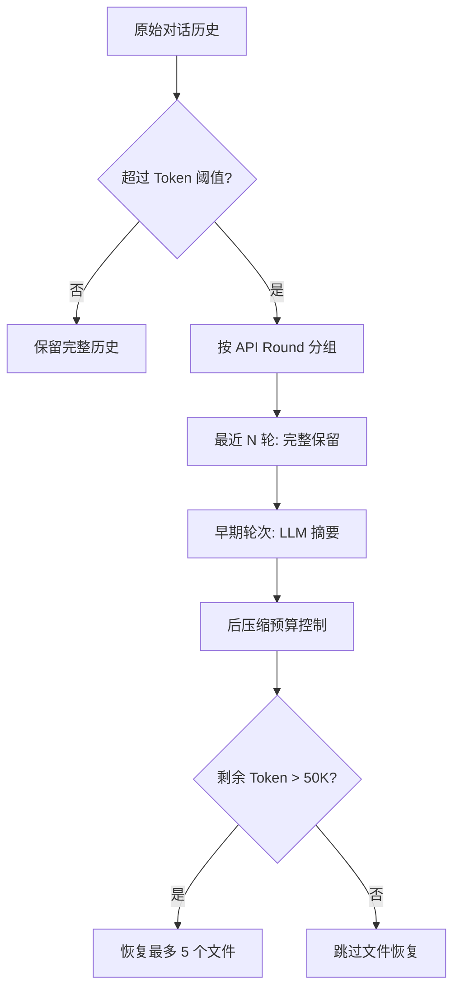
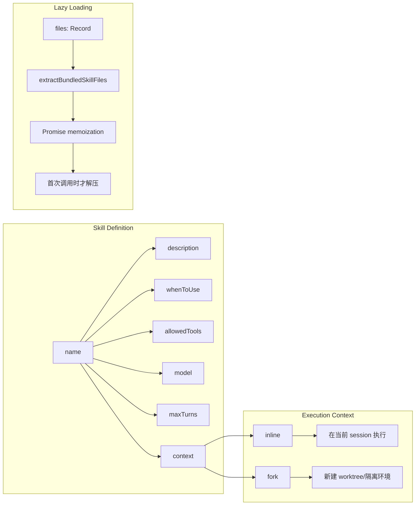
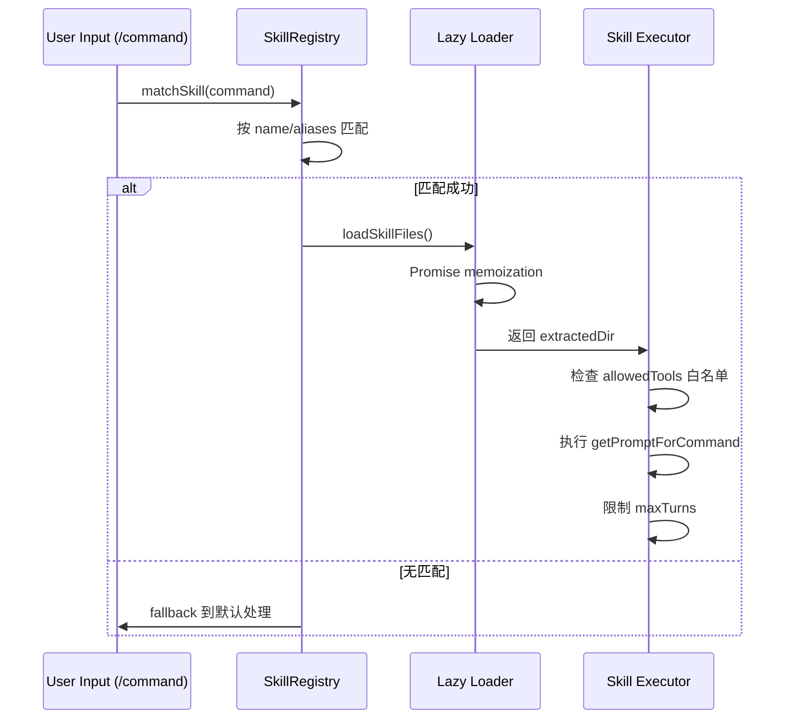
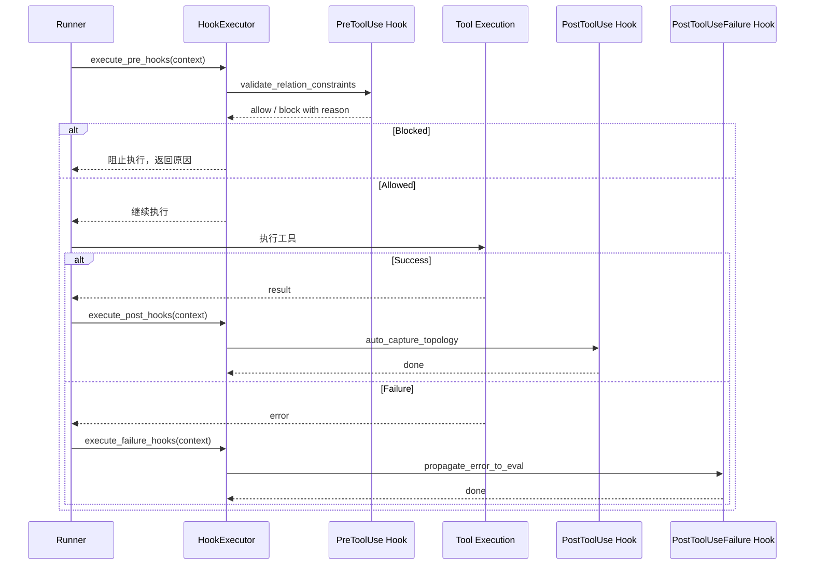

# Claude Code 架构借鉴与集成实施计划

> 目标：将 Claude Code 的成熟架构模式（Skill System、Context Compaction、Agent Definition、Hooks）集成到 CAD 迭代系统中，解决当前 relation_eval 假阻塞、上下文膨胀、修复策略分散等问题。

---

## 1. 背景与目标

### 1.1 当前项目痛点（基于 2026-03-31 Benchmark 分析）

| 问题案例 | 症状 | 根因 |
|---------|------|------|
| **L2_130** | `add_path` 返回 `Exit code: 1`，但 `relation_eval` 仅显示 `annular_profile_section fail`，`blocking_eval_ids` 为空 | 动作执行失败未被传递到阻塞器层，反馈层只关注几何关系 |
| **L2_192** | 需求要求 4 个分布孔，模型输出 6 个孔，`relation_eval` 仍显示 `annular_topology_core pass` | 当前 feedback 只覆盖几何关系（同心、共轴），不覆盖计数约束和阵列模式 |
| **L2_149** | Post-solid 阶段 `sweep_path_geometry` 假失败（`arc_angle_degrees: null`），实际 path 正确 | 草图态数据在拓扑变化后不可靠，缺乏数据新鲜度标记 |
| **上下文膨胀** | `round_04_request_full.json` 达 84K chars/2600+ lines，包含完整 topology faces/edges 数组 | 无 budget management，所有历史数据原样保留 |

### 1.2 Claude Code 借鉴价值

Claude Code（~51万行 TypeScript，1884 文件）的以下机制可直接解决上述问题：

1. **Context Compaction** (`src/services/compact/`)：Group by API Round + Partial Compact + Post-compact budget
2. **Skill System** (`src/skills/`)：将复杂工作流封装为可复用的 `/command`，支持权限控制
3. **Agent Definition** (`src/tools/AgentTool/`)：白名单/黑名单工具控制、模型分级、maxTurns 限制
4. **Hooks** (`src/utils/hooks.ts`)：Pre/Post tool use 生命周期，用于验证和自动触发

---

## 2. Claude Code 关键机制详解

### 2.1 Context Compaction（上下文压缩）

#### 2.1.1 核心文件路径
- `~/code/claude-code/src/services/compact/compact.ts:122-130` - Budget 常量定义
- `~/code/claude-code/src/services/compact/grouping.ts` - API Round 分组逻辑（核心）
- `~/code/claude-code/src/services/compact/prompt.ts` - 压缩提示词模板
- `~/code/claude-code/src/services/compact/microCompact.ts` - 轻量级压缩

#### 2.1.2 关键机制：Group by API Round

Claude Code 采用**以 Assistant Message ID 变化为边界**的分组策略：

```typescript
// ~/code/claude-code/src/services/compact/grouping.ts
export function groupMessagesByApiRound(messages: Message[]): Message[][] {
  const groups: Message[][] = []
  let currentGroup: Message[] = []
  let lastAssistantId: string | undefined

  for (const msg of messages) {
    if (msg.type === 'assistant' && msg.message.id !== lastAssistantId) {
      // 新的 Assistant 消息开始，结束当前组
      if (currentGroup.length > 0) {
        groups.push(currentGroup)
      }
      currentGroup = [msg]
      lastAssistantId = msg.message.id
    } else {
      currentGroup.push(msg)
    }
  }
  // ...
}
```

**关键设计决策**：
1. **保持 tool_use/tool_result 配对** - 同一组内必须包含完整的请求-响应周期
2. **早期轮次可整体摘要** - 不影响后续工具调用的完整性
3. **Partial Compact** - 仅压缩早期内容，保留最近 N 轮完整上下文

**对 CAD 项目的映射**：
- 当前 `action_history` 是扁平数组，每轮包含完整的 `result_snapshot`
- 应改为：最近 2-3 轮保留完整 `topology_index`，早期轮次仅保留 `relation_summary`

#### 2.1.3 Post-Compact Budget Management

```typescript
// ~/code/claude-code/src/services/compact/compact.ts:122-130
export const POST_COMPACT_MAX_FILES_TO_RESTORE = 5
export const POST_COMPACT_TOKEN_BUDGET = 50_000
export const POST_COMPACT_MAX_TOKENS_PER_FILE = 5_000
export const POST_COMPACT_MAX_TOKENS_PER_SKILL = 5_000
export const POST_COMPACT_SKILLS_TOKEN_BUDGET = 25_000
```

**分层预算策略**：



**对 CAD 项目的映射**：
- `action_history` 早期轮次可摘要为 `action_type + success` 标记
- `topology_index` 超限时保留关键 entities，其余做统计摘要

#### 2.1.4 Partial Compact（部分压缩）

当总 token 超过阈值时，仅压缩早期内容，保留最近 N 轮的完整上下文：

```typescript
// 伪代码逻辑
if (estimatedTokens > THRESHOLD) {
  // 保留最近 3 轮完整内容
  const recent = messages.slice(-3)
  // 早期轮次做摘要
  const early = await compactMessages(messages.slice(0, -3))
  return [early, ...recent]
}
```

---

### 2.2 Skill System（技能系统）

#### 2.2.1 核心文件路径
- `~/code/claude-code/src/skills/bundledSkills.ts:15-41` - Skill Schema 定义
- `~/code/claude-code/src/skills/bundledSkills.ts:64-72` - 懒加载机制（Promise memoization）
- `~/code/claude-code/src/skills/loadSkillsDir.ts` - 磁盘技能加载
- `~/code/claude-code/src/tools/SkillTool/SkillTool.tsx` - 技能执行工具

#### 2.2.2 Skill 定义 Schema

```typescript
// ~/code/claude-code/src/skills/bundledSkills.ts:15-41
export type BundledSkillDefinition = {
  name: string
  description: string
  aliases?: string[]
  whenToUse?: string
  allowedTools?: string[]        // 关键：工具白名单
  model?: string                 // 专用模型
  disableModelInvocation?: boolean
  userInvocable?: boolean
  isEnabled?: () => boolean
  hooks?: HooksSettings
  context?: 'inline' | 'fork'    // 执行上下文
  agent?: string                 // 关联 Agent
  files?: Record<string, string> // 懒加载的参考文件
  getPromptForCommand: (args: string, context: ToolUseContext) => Promise<ContentBlockParam[]>
}
```

**Skill 系统架构**：



**对 CAD 项目的映射**：
- 散落在 `relation_feedback.py` 中的修复逻辑可封装为 Skills
- 大量 CAD 特征模板（washer、flange、pipe）可作为 bundled skills，按需加载

#### 2.2.3 懒加载机制（Promise Memoization）

```typescript
// ~/code/claude-code/src/skills/bundledSkills.ts:64-72
// 技能文件首次调用时才解压到磁盘
let extractionPromise: Promise<string | null> | undefined
getPromptForCommand = async (args, ctx) => {
  extractionPromise ??= extractBundledSkillFiles(definition.name, files)
  const extractedDir = await extractionPromise
  // ...
}
```

**关键设计**：`??=` 操作符确保 `extractBundledSkillFiles` 只在首次调用时执行，后续调用复用同一 Promise。

**Skill 匹配与路由流程**：



---

### 2.3 Agent Definition（Agent 定义）

#### 2.3.1 核心文件路径
- `~/code/claude-code/src/tools/AgentTool/loadAgentsDir.ts:106-133` - Agent Schema 定义
- `~/code/claude-code/src/tools/AgentTool/builtInAgents.ts` - 内置 Agent 注册
- `~/code/claude-code/src/tools/AgentTool/built-in/exploreAgent.ts` - Explore Agent 示例
- `~/code/claude-code/src/tools/AgentTool/built-in/planAgent.ts` - Plan Agent 示例（Read-Only 模式）

#### 2.3.2 Agent 定义 Schema

```typescript
// ~/code/claude-code/src/tools/AgentTool/loadAgentsDir.ts:106-133
export type BaseAgentDefinition = {
  agentType: string
  whenToUse: string
  tools?: string[]              // 白名单
  disallowedTools?: string[]    // 黑名单（关键！）
  skills?: string[]             // 预加载 skills
  model?: string
  effort?: EffortValue          // 'low' | 'medium' | 'high'
  permissionMode?: PermissionMode
  maxTurns?: number             // 最大轮数限制
  memory?: AgentMemoryScope     // 'user' | 'project' | 'local'
  hooks?: HooksSettings
  omitClaudeMd?: boolean        // 省略 CLAUDE.md 节省 token
  background?: boolean
  isolation?: 'worktree' | 'remote'  // 执行隔离
}
```

#### 2.3.3 Plan Agent 示例（Read-Only 模式）

```typescript
// ~/code/claude-code/src/tools/AgentTool/built-in/planAgent.ts
export const PLAN_AGENT: BuiltInAgentDefinition = {
  agentType: 'Plan',
  whenToUse: 'Software architect agent for designing implementation plans...',
  disallowedTools: [
    AGENT_TOOL_NAME,
    EXIT_PLAN_MODE_TOOL_NAME,
    FILE_EDIT_TOOL_NAME,      // 关键：禁止文件修改
    FILE_WRITE_TOOL_NAME,
    NOTEBOOK_EDIT_TOOL_NAME,
  ],
  source: 'built-in',
  tools: EXPLORE_AGENT.tools,  // 仅继承 Explore 的工具（只读）
  baseDir: 'built-in',
  model: 'inherit',
  omitClaudeMd: true,          // 节省 token
  getSystemPrompt: () => getPlanV2SystemPrompt(),
}
```

**Agent 工具权限控制架构**：

```mermaid
graph TD
    subgraph "工具权限策略"
        A[定义 Agent] --> B{权限模式}
        B -->|白名单| C[tools: ['query_topology', 'query_geometry']]
        B -->|黑名单| D[disallowedTools: ['create_sketch', 'extrude']]
        B -->|混合| E[白名单 + 黑名单排除]
    end

    subgraph "执行时检查"
        F[Agent Spawner] --> G[拦截 tool_use]
        G --> H{tool 在 allowedTools?}
        H -->|否| I[拒绝执行]
        H -->|是| J{tool 在 disallowedTools?}
        J -->|是| I
        J -->|否| K[允许执行]
    end

    E --> F
```

**对 CAD 项目的映射**：
- 可为不同 CAD 阶段定义专用 Agent（sketch_agent、sweep_repair_agent、hole_pattern_agent 等）
- 通过 `allowed_actions` / `disallowed_actions` 实现权限控制
- `maxTurns` 限制防止无限循环

---

### 2.4 Hooks 系统

#### 2.4.1 核心文件路径
- `~/code/claude-code/src/utils/hooks.ts` - Hook 执行框架
- `~/code/claude-code/src/types/hooks.ts` - Hook 类型定义

#### 2.4.2 Hook 类型与执行流程

```typescript
// ~/code/claude-code/src/types/hooks.ts
export type HookEvent =
  | PreToolUseHookInput          // 工具执行前
  | PostToolUseHookInput         // 工具执行成功
  | PostToolUseFailureHookInput  // 工具执行失败
  | PreCompactHookInput          // 压缩前
  | PostCompactHookInput         // 压缩后
  | TaskCreatedHookInput
  | TaskCompletedHookInput
  // ...
```

**Hook 执行生命周期**：



**对 CAD 项目的映射**：
- **Pre-action**: 验证约束条件，阻止无效操作
- **Post-action**: 自动捕获 topology 变化，解决 L2_149 假失败问题
- **Post-failure**: 将执行错误传递到 `relation_eval`，解决 L2_130 问题
- **Pre-compact**: 确保压缩时保留关键的 `relation_eval` 数据

---

## 3. Claude Code 与 CAD 项目映射对照

| Claude Code 机制 | 对应 CAD 项目痛点 | 具体应用场景 |
|-----------------|------------------|-------------|
| **Group by API Round** | `action_history` 扁平无分组 | 按 round 分组，早期轮次摘要化 |
| **Post-Compact Budget** | `request_full.json` 达 84K chars | 限制 topology entities 数量 |
| **allowedTools 白名单** | 所有 Agent 拥有全部 tools | Sketch Agent 禁止 3D 操作 |
| **maxTurns 限制** | ReAct 循环可能无限 | 限制每轮最大迭代次数 |
| **Hooks: PreToolUse** | L2_130 执行失败未传递 | 在 pre-action 中验证约束 |
| **Hooks: PostToolUse** | L2_149 假失败 | 自动触发 query_topology |
| **Skills: whenToUse** | relation_feedback 硬编码 | 动态匹配 pattern_hole_array |
| **omitClaudeMd** | prompt 包含大量 system 信息 | 省略非必要上下文 |

---

## 4. 参考文件

### Claude Code 源码
- `~/code/claude-code/src/services/compact/compact.ts:122-130` - Budget 常量定义
- `~/code/claude-code/src/services/compact/grouping.ts` - API Round 分组逻辑
- `~/code/claude-code/src/services/compact/prompt.ts` - 压缩提示词模板
- `~/code/claude-code/src/skills/bundledSkills.ts:15-41` - Skill Schema 定义
- `~/code/claude-code/src/skills/bundledSkills.ts:64-72` - 懒加载机制
- `~/code/claude-code/src/tools/AgentTool/loadAgentsDir.ts:106-133` - Agent Schema 定义
- `~/code/claude-code/src/tools/AgentTool/built-in/planAgent.ts` - Read-Only Agent 示例
- `~/code/claude-code/src/utils/hooks.ts` - Hooks 执行框架
- `~/code/claude-code/src/types/hooks.ts` - Hook 类型定义

### 当前项目相关
- `src/sub_agent_runtime/relation_feedback.py` - 需重构为 Skills
- `src/sub_agent_runtime/runner.py` - 需集成 Compaction + Hooks
- `src/sub_agent/codegen.py` - 需集成 Skill/Agent 路由
- `docs/work_logs/2026-03-27.md` - 关系层重构背景

---

*文档版本: 2026-04-02 (修订版)*
*作者: Claude (基于 Claude Code 源码深度分析)*
*状态: 实施指导文档*
*Claude Code 源码路径: ~/code/claude-code/*
