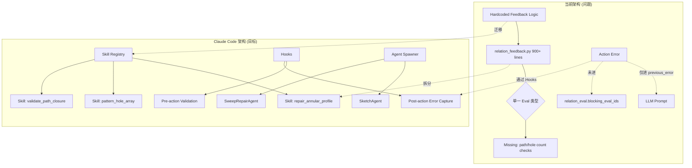
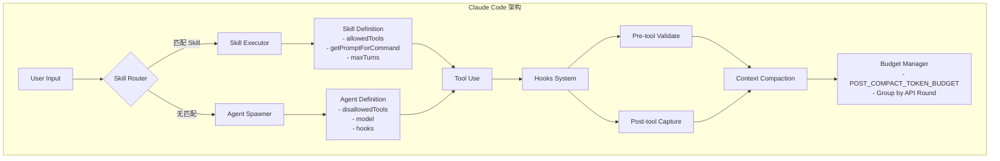
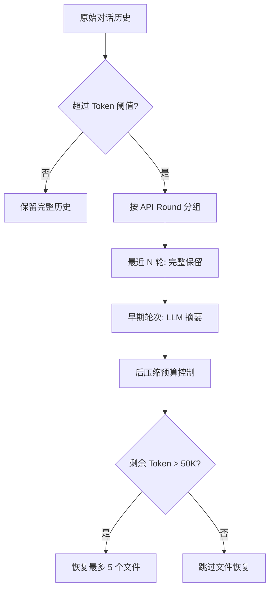
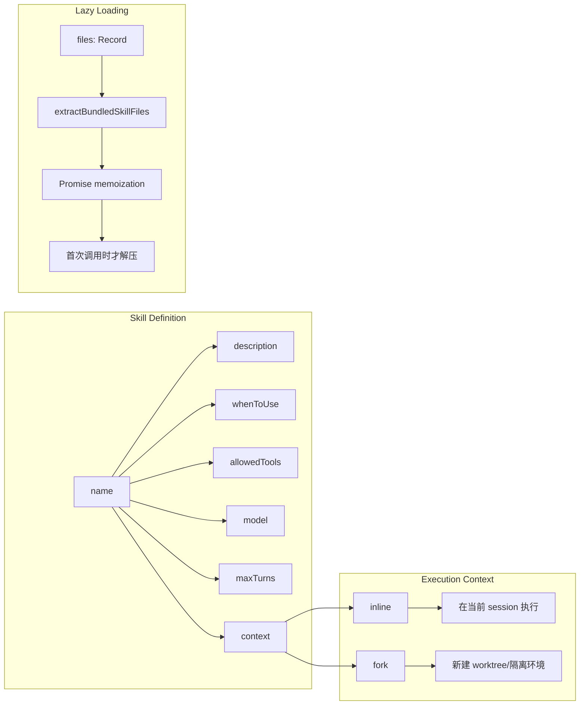
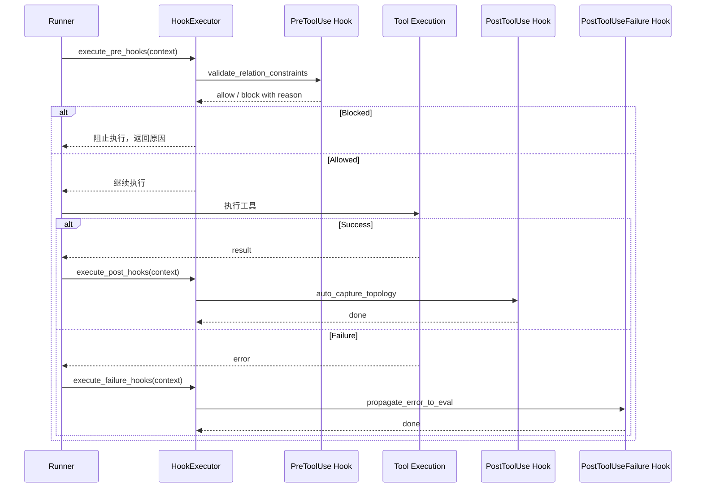
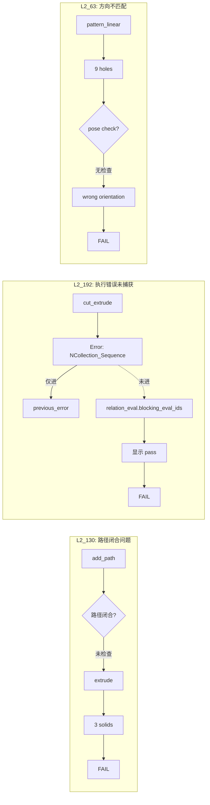

# Claude Code 架构迁移指南：解决 CAD 迭代系统核心问题

> **目标**: 将 Claude Code 的成熟架构模式迁移到 CAD 迭代系统，解决当前反馈断裂、扩展性不足、维护困难等问题。
>
> **Claude Code 源码路径**: `~/code/claude-code/`

---

## 1. 执行摘要

### 1.1 当前系统痛点（基于 2026-04-01 Benchmark 分析）

| 问题案例 | 症状 | 根因 |
|---------|------|------|
| **L2_130** | `add_path` 返回 `Exit code: 1`，但 `relation_eval` 仅显示 `annular_profile_section fail`，`blocking_eval_ids` 为空 | 动作执行失败未被传递到阻塞器层，反馈层只关注几何关系 |
| **L2_192** | 需求要求 6 个分布孔，模型误用 PCD 半径作为孔半径（27.5mm 而非 3mm），导致 cut_extrude 抛出 `NCollection_Sequence::ChangeValue`，但 relation_eval 仍显示 `pass` | 当前 feedback 只覆盖几何关系（同心、共轴），不覆盖计数约束和阵列模式；执行错误未被 `relation_eval` 捕获 |
| **L2_63** | 方向/朝向不匹配（axis-aligned bbox differs） | 无 pose 约束反馈机制 |
| **上下文膨胀** | `round_04_request_full.json` 达 84K chars/2600+ lines，`latest_action_result.snapshot` 完整传递 218KB 数据未截断 | 无 budget management，所有历史数据原样保留 |

### 1.2 当前架构 vs 目标架构



---

## 2. Claude Code 核心架构解析

### 2.1 整体架构图



### 2.2 Context Compaction 详解

**Claude Code 源码位置**: `~/code/claude-code/src/services/compact/compact.ts` (~46K lines)

**核心文件路径**:
- `~/code/claude-code/src/services/compact/compact.ts:122-130` - Budget 常量定义
- `~/code/claude-code/src/services/compact/grouping.ts` - API Round 分组逻辑
- `~/code/claude-code/src/services/compact/prompt.ts` - 压缩提示词模板
- `~/code/claude-code/src/services/compact/microCompact.ts` - 轻量级压缩

**核心常量定义**:
```typescript
// ~/code/claude-code/src/services/compact/compact.ts:122-130
export const POST_COMPACT_MAX_FILES_TO_RESTORE = 5;
export const POST_COMPACT_TOKEN_BUDGET = 50_000;
export const POST_COMPACT_MAX_TOKENS_PER_FILE = 5_000;
export const POST_COMPACT_MAX_TOKENS_PER_SKILL = 5_000;
export const POST_COMPACT_SKILLS_TOKEN_BUDGET = 25_000;
```

**Group by API Round 分组逻辑**:
```typescript
// ~/code/claude-code/src/services/compact/grouping.ts
export function groupMessagesByApiRound(messages: Message[]): Message[][] {
  const groups: Message[][] = [];
  let currentGroup: Message[] = [];
  let lastAssistantId: string | undefined;

  for (const msg of messages) {
    if (msg.type === 'assistant' && msg.message.id !== lastAssistantId) {
      // 新的 Assistant 消息开始，结束当前组
      if (currentGroup.length > 0) {
        groups.push(currentGroup);
      }
      currentGroup = [msg];
      lastAssistantId = msg.message.id;
    } else {
      currentGroup.push(msg);
    }
  }
  // ...
}
```

**关键设计决策**：
1. **保持 tool_use/tool_result 配对** - 同一组内必须包含完整的请求-响应周期
2. **早期轮次可整体摘要** - 不影响后续工具调用的完整性
3. **Partial Compact** - 仅压缩早期内容，保留最近 N 轮完整上下文

**Post-Compact Budget Management**:


### 2.3 Skill System 详解

**Claude Code 源码位置**: `~/code/claude-code/src/skills/bundledSkills.ts`

**核心文件路径**:
- `~/code/claude-code/src/skills/bundledSkills.ts:15-41` - Skill Schema 定义
- `~/code/claude-code/src/skills/bundledSkills.ts:64-72` - 懒加载机制（Promise memoization）
- `~/code/claude-code/src/skills/loadSkillsDir.ts` - 磁盘技能加载
- `~/code/claude-code/src/tools/SkillTool/SkillTool.tsx` - 技能执行工具

**Skill Schema 定义**:
```typescript
// ~/code/claude-code/src/skills/bundledSkills.ts:15-41
export type BundledSkillDefinition = {
  name: string;
  description: string;
  aliases?: string[];
  whenToUse?: string;
  allowedTools?: string[];        // 关键：工具白名单
  model?: string;                 // 专用模型
  maxTurns?: number;              // 最大轮数限制
  context?: 'inline' | 'fork';    // 执行上下文
  hooks?: HooksSettings;          // 生命周期钩子
  files?: Record<string, string>; // 懒加载的参考文件
  getPromptForCommand: (args: string, context: ToolUseContext) => Promise<ContentBlockParam[]>;
};
```

**懒加载机制** (Promise Memoization):
```typescript
// ~/code/claude-code/src/skills/bundledSkills.ts:64-72
// 技能文件首次调用时才解压到磁盘
let extractionPromise: Promise<string | null> | undefined;
getPromptForCommand = async (args, ctx) => {
  extractionPromise ??= extractBundledSkillFiles(definition.name, files);
  const extractedDir = await extractionPromise;
  // ...
};
```

**关键设计**：`??=` 操作符确保 `extractBundledSkillFiles` 只在首次调用时执行，后续调用复用同一 Promise。

**Skill 系统架构**:


### 2.4 Agent Definition 详解

**Claude Code 源码位置**: `~/code/claude-code/src/tools/AgentTool/loadAgentsDir.ts`

**核心文件路径**:
- `~/code/claude-code/src/tools/AgentTool/loadAgentsDir.ts:106-133` - Agent Schema 定义
- `~/code/claude-code/src/tools/AgentTool/builtInAgents.ts` - 内置 Agent 注册
- `~/code/claude-code/src/tools/AgentTool/built-in/exploreAgent.ts` - Explore Agent 示例
- `~/code/claude-code/src/tools/AgentTool/built-in/planAgent.ts` - Plan Agent 示例

**Agent Schema 定义**:
```typescript
// ~/code/claude-code/src/tools/AgentTool/loadAgentsDir.ts:106-133
export type BaseAgentDefinition = {
  agentType: string;
  whenToUse: string;
  tools?: string[];              // 白名单
  disallowedTools?: string[];    // 黑名单（关键！）
  skills?: string[];             // 预加载 skills
  model?: string;
  effort?: EffortValue;          // 'low' | 'medium' | 'high'
  permissionMode?: PermissionMode;
  maxTurns?: number;             // 最大轮数限制
  memory?: AgentMemoryScope;     // 'user' | 'project' | 'local'
  hooks?: HooksSettings;
  omitClaudeMd?: boolean;        // 省略 CLAUDE.md 节省 token
  background?: boolean;
  isolation?: 'worktree' | 'remote';  // 执行隔离
};
```

**Plan Agent 示例** (Read-Only 模式):
```typescript
// ~/code/claude-code/src/tools/AgentTool/built-in/planAgent.ts
export const PLAN_AGENT: BuiltInAgentDefinition = {
  agentType: 'Plan',
  whenToUse: 'Software architect agent for designing implementation plans...',
  disallowedTools: [
    AGENT_TOOL_NAME,
    EXIT_PLAN_MODE_TOOL_NAME,
    FILE_EDIT_TOOL_NAME,      // 关键：禁止文件修改
    FILE_WRITE_TOOL_NAME,
    NOTEBOOK_EDIT_TOOL_NAME,
  ],
  source: 'built-in',
  tools: EXPLORE_AGENT.tools,  // 仅继承 Explore 的工具（只读）
  baseDir: 'built-in',
  model: 'inherit',
  omitClaudeMd: true,          // 节省 token
};
```

**Agent 工具权限控制架构**:
```mermaid
graph TD
    subgraph "工具权限策略"
        A[定义 Agent] --> B{权限模式}
        B -->|白名单| C[tools: ['query_topology', 'query_geometry']]
        B -->|黑名单| D[disallowedTools: ['create_sketch', 'extrude']]
        B -->|混合| E[白名单 + 黑名单排除]
    end

    subgraph "执行时检查"
        F[Agent Spawner] --> G[拦截 tool_use]
        G --> H{tool 在 allowedTools?}
        H -->|否| I[拒绝执行]
        H -->|是| J{tool 在 disallowedTools?}
        J -->|是| I
        J -->|否| K[允许执行]
    end

    E --> F
```

### 2.5 Hooks System 详解

**Claude Code 源码位置**: `~/code/claude-code/src/utils/hooks.ts`

**核心文件路径**:
- `~/code/claude-code/src/utils/hooks.ts` - Hook 执行框架
- `~/code/claude-code/src/types/hooks.ts` - Hook 类型定义

**Hook 类型定义**:
```typescript
// ~/code/claude-code/src/types/hooks.ts
export type HookEvent =
  | PreToolUseHookInput          // 工具执行前
  | PostToolUseHookInput         // 工具执行成功
  | PostToolUseFailureHookInput  // 工具执行失败
  | PreCompactHookInput          // 压缩前
  | PostCompactHookInput         // 压缩后
  | TaskCreatedHookInput
  | TaskCompletedHookInput;

// Pre-tool 验证
export async function executePreToolUseHooks(
  input: PreToolUseHookInput,
): Promise<PreToolUseHookOutput> {
  // 可以修改 toolInput 或阻止执行
}

// Post-tool 捕获
export async function executePostToolUseHooks(
  input: PostToolUseHookInput,
): Promise<void> {
  // 捕获结果、触发副作用
}
```

**Hook 执行生命周期**:


### 2.6 多 Agent 协调架构（Coordinator Mode）

Claude Code 支持通过 `AgentTool` 启动子 Agent，实现任务分解和权限隔离：

```mermaid
graph TD
    subgraph "Coordinator Agent"
        C[Coordinator] --> D{任务分解}
        D --> E[探索任务]
        D --> F[规划任务]
        D --> G[编辑任务]
    end

    subgraph "Worker Agents"
        E --> H[Explore Agent<br/>只读工具]
        F --> I[Plan Agent<br/>禁止编辑]
        G --> J[Edit Agent<br/>完整权限]
    end

    subgraph "权限控制"
        H --> K[tools: [Read, Glob, Grep]]
        I --> L[disallowedTools: [Edit, Write]]
        J --> M[maxTurns: 5]
    end

    C --> N[汇总结果]
    H --> N
    I --> N
    J --> N
```

**关键设计**：
1. **权限最小化原则** - 每个子 Agent 只获得完成任务所需的最小工具集
2. **maxTurns 限制** - 防止子 Agent 无限循环
3. **隔离执行** - `context: 'fork'` 时创建独立 worktree

---

## 3. 当前系统痛点与映射

### 3.1 问题定位图



### 3.2 根本原因分析

| 问题 | 当前实现 | Claude Code 对应 | 缺失能力 |
|-----|---------|-----------------|---------|
| L2_130 | `relation_feedback.py` 只有 sweep/annular 检查 | Skill System | 缺少 `validate_path_closure` Skill |
| L2_192 | 错误只进 `previous_error` | Hooks: PostToolUse | 缺少 `post_action_error_to_eval` Hook |
| L2_192 | 无 hole count 检查 | Skill: pattern_hole_array | 缺少计数约束验证 |
| L2_63 | 无 pose 检查 | Agent: PoseValidationAgent | 缺少方向验证 Agent |
| Context | 部分压缩 | Full Compaction | 未压缩 `action_history[].result_snapshot` |

### 3.3 Claude Code 机制与 CAD 项目映射对照

| Claude Code 机制 | 对应 CAD 项目痛点 | 具体应用场景 |
|-----------------|------------------|-------------|
| **Group by API Round** | `action_history` 扁平无分组 | 按 round 分组，早期轮次摘要化 |
| **Post-Compact Budget** | `request_full.json` 达 84K chars | 限制 topology entities 数量 |
| **allowedTools 白名单** | 所有 Agent 拥有全部 tools | Sketch Agent 禁止 3D 操作 |
| **maxTurns 限制** | ReAct 循环可能无限 | 限制每轮最大迭代次数 |
| **Hooks: PreToolUse** | L2_130 执行失败未传递 | 在 pre-action 中验证约束 |
| **Hooks: PostToolUse** | L2_149 假失败 | 自动触发 query_topology |
| **Skills: whenToUse** | relation_feedback 硬编码 | 动态匹配 pattern_hole_array |
| **omitClaudeMd** | prompt 包含大量 system 信息 | 省略非必要上下文 |

---

## 4. 参考文件索引

### Claude Code 源码
```
~/code/claude-code/src/services/compact/compact.ts:122-130       # Budget 常量定义
~/code/claude-code/src/services/compact/grouping.ts               # API Round 分组逻辑
~/code/claude-code/src/services/compact/prompt.ts                 # 压缩提示词模板
~/code/claude-code/src/skills/bundledSkills.ts:15-41              # Skill Schema 定义
~/code/claude-code/src/skills/bundledSkills.ts:64-72              # 懒加载机制
~/code/claude-code/src/tools/AgentTool/loadAgentsDir.ts:106-133   # Agent Schema 定义
~/code/claude-code/src/tools/AgentTool/built-in/planAgent.ts      # Read-Only Agent 示例
~/code/claude-code/src/utils/hooks.ts                             # Hooks 执行框架
~/code/claude-code/src/types/hooks.ts                             # Hook 类型定义
```

### 当前项目相关
```
src/sub_agent_runtime/runner.py:1473-1477     # 错误处理（仅进 previous_error）
src/sub_agent_runtime/runner.py:283-285       # latest_action_result 未截断
src/sub_agent_runtime/relation_feedback.py    # 需重构为 Skills
src/sub_agent/codegen.py                      # 需集成 Skill/Agent 路由
docs/work_logs/2026-04-01_Benchmark_Failure_Analysis_Report.md  # 失败案例分析
```

---

*文档版本: 2026-04-02 (合并修订版)*
*作者: Claude*
*状态: 架构分析文档*
*Claude Code 源码路径: ~/code/claude-code/*
