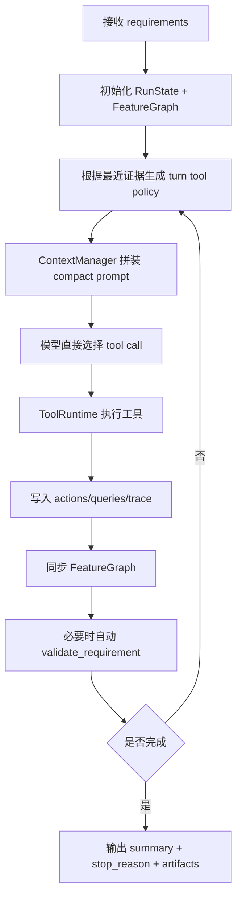

# 2026-04-07 架构现状与后续计划汇报

> 适用场景：面向上级进行阶段性汇报  
> 汇报目标：说明当前系统已经完成的架构演进、当前主要问题、以及下一阶段的收敛方向

---

## 1. 执行摘要

当前 `aicad.subagent.iteration` 已从“以 planner 为中心的 CAD 动作生成器”明显迁移到“以 runtime 为中心的模型直驱工具循环”。

今天的关键结论有三点：

1. **V2 架构已经成型**  
   当前主方向不再是“先让 planner 产计划，再由 runner 执行”，而是由模型直接选择工具，runtime 负责状态、上下文压缩、工具约束和证据落盘。核心变化是把语义状态正式收敛到 runtime-local `FeatureGraph` 中，而不是每轮依赖 history 和 feedback 文本临时拼接当前焦点。  
   参考：[DESIGN_INTENT.md](../cad_iteration/DESIGN_INTENT.md)、[SYSTEM_RECORD.json](../cad_iteration/SYSTEM_RECORD.json)、[agent_loop_v2.py](../../src/sub_agent_runtime/agent_loop_v2.py)

2. **外部接口保持稳定，内部仍处于双栈过渡期**  
   对上游保持稳定的仍然是 `IterationRequest`、`IterationRunResult` 和 `IterativeSubAgentRunner`。内部实现目前同时保留 `legacy` 和 `v2` 两条路径，说明这次重构是“包住接口的内部替换”，而不是一次性推翻。  
   参考：[contracts.py](../../src/sub_agent_runtime/contracts.py)、[runner.py](../../src/sub_agent_runtime/runner.py#L92)

3. **当前最主要的成本问题已经定位：structured action 主路径过重**  
   以 `benchmark/runs/20260407_165907/L1_159` 为代表的 case 表明，结构化 action 在简单任务上也可能产生过多轮次、额外的 semantic admission、证据新鲜度冲突和尾部 code repair，最终导致 token 消耗偏高。  
   这不是任务本身复杂，而是当前主路径仍然过度依赖 structured action。  
   参考：`benchmark/runs/20260407_165907/L1_159/`

一句话概括当前判断：

> **系统方向已经正确，当前问题不在“是否有 V2”，而在“如何让 V2 真正收口成唯一主路径”。**

---

## 2. 当前架构现状

## 2.1 架构分层

当前系统可以理解为 5 层：

| 层级 | 作用 | 当前状态 |
|---|---|---|
| 上游稳定接口层 | 对外暴露统一请求/结果 contract | 已稳定 |
| Runtime 入口层 | 根据运行模式切换 `legacy` / `v2` | 过渡中 |
| V2 运行时核心 | 管主循环、状态、prompt、tool policy | 已成型 |
| MCP / Sandbox 执行层 | 执行 `execute_cadquery`、`apply_cad_action`、查询与校验 | 可用，但 service 偏厚 |
| Observability / Benchmark 层 | 落盘中间证据、做 case/run 聚合分析 | 已明显增强 |

## 2.2 关键模块职责

### 1) 外部稳定 contract

- `IterationRequest`
- `IterationRunResult`
- `IterativeSubAgentRunner`

这一层的意义是：即使内部 runtime 被重写，上游调用方也不需要跟着大改。

参考：
- [contracts.py](../../src/sub_agent_runtime/contracts.py)
- [runner.py](../../src/sub_agent_runtime/runner.py#L92)

### 2) Runtime 入口：双栈共存

`runner.py` 仍然是统一入口，但会根据 `AICAD_RUNTIME_MODE` 决定走 `legacy` 还是 `v2`。

这意味着当前状态不是“旧架构已下线”，而是：

- 外部入口统一
- 内部实现双栈共存
- V2 是 preferred path，但不是唯一实现

参考：
- [runner.py#L92](../../src/sub_agent_runtime/runner.py#L92)

### 3) V2 核心：runtime-centered

V2 的核心模块已经比较清晰：

| 模块 | 职责 |
|---|---|
| `agent_loop_v2.py` | 主循环、每轮执行、trace 落盘、stop reason |
| `turn_state.py` | `RunState`、turn record、evidence store |
| `context_manager.py` | prompt surface、context compaction、runtime skill notes |
| `tool_runtime.py` | 工具 schema、参数注入、单轮写工具约束、工具执行 |
| `feature_graph.py` | runtime-local 语义图，维护 feature / blocker / evidence / active focus |
| `diagnostics.py` | validation core/diagnostic lane 拆分 |

参考：
- [agent_loop_v2.py#L49](../../src/sub_agent_runtime/agent_loop_v2.py#L49)
- [turn_state.py](../../src/sub_agent_runtime/turn_state.py)
- [context_manager.py](../../src/sub_agent_runtime/context_manager.py)
- [tool_runtime.py#L73](../../src/sub_agent_runtime/tool_runtime.py#L73)
- [feature_graph.py#L88](../../src/sub_agent_runtime/feature_graph.py#L88)

### 4) FeatureGraph：新的语义状态核心

今天最重要的架构变化，是 `FeatureGraph` 已经进入真实 runtime，而不是停留在 prompt 文案层。

它的职责不是直接修改几何，而是统一维护：

- requirement intent
- feature family 分解
- 当前 blocked / completed / active targets
- 最近 write / validation / probe 证据

这解决的是一个长期问题：过去系统每轮都要从 history、validator blockers、runtime skill prose 里重新“猜”当前语义焦点；现在这些信息有了统一状态容器。

参考：
- [DESIGN_INTENT.md#L150](../cad_iteration/DESIGN_INTENT.md#L150)
- [FEATURE_GRAPH_RUNTIME.md](../cad_iteration/FEATURE_GRAPH_RUNTIME.md)
- [feature_graph.py#L88](../../src/sub_agent_runtime/feature_graph.py#L88)

### 5) MCP / Sandbox 服务层

当前服务端结构是：

- `server.py` 负责 MCP tools 注册和依赖装配
- `service.py` 负责 execute/query/validate/render 等应用逻辑
- `sandbox/` 负责真实 sandbox 执行

这套结构目前是可用的，但 `SandboxMCPService` 已经承担了较多职责，后续如果继续演进，建议进一步拆分 execution/query/validation/session 责任。

参考：
- [server.py#L377](../../src/sandbox_mcp_server/server.py#L377)
- [service.py#L275](../../src/sandbox_mcp_server/service.py#L275)

---

## 3. 当前 runtime 流程

当前 V2 的一轮执行流程大致如下：

这个流程和旧架构最大的区别在于：

- **模型直接选工具**
- **runtime 管控工具面**
- **语义状态成为运行时一等对象**
- **所有中间过程落盘、可诊断**

参考：
- [agent_loop_v2.py#L65](../../src/sub_agent_runtime/agent_loop_v2.py#L65)
- [TOOL_SURFACE.md](../cad_iteration/TOOL_SURFACE.md)
- [ITERATION_PROTOCOL.md](../cad_iteration/ITERATION_PROTOCOL.md)

---

## 4. 今天实际推进了什么

## 4.1 已落地的架构推进

基于今天的工作记录，可以确认以下事项已经落地：

1. **FeatureGraph 已接入真实 runtime**
   - 初始化、digest、sync 和落盘都已接线
   - `query_graph_state` / `patch_feature_graph` 已进入 tool surface

2. **Graph-driven policy 已进入编排逻辑**
   - `graph_refresh_after_read_stall`
   - `graph_refresh_after_incomplete_finish`
   - `code_first_after_feature_budget_risk`

3. **Benchmark 已开始直接消费 graph 产物**
   - round digest 中可看 graph snapshot
   - run/case 级分析中可看 blocked / unsatisfied features

4. **今天进一步完成了架构与问题梳理**
   - 明确了当前系统的过渡态结构
   - 明确了 structured action 在简单 case 上的成本问题

参考：
- [2026-04-07.md](./2026-04-07.md)

## 4.2 已获得的验证结果

### 真实 probe

- `test_runs/20260407_feature_graph_probe_v2`
- `test_runs/20260407_220500`

说明：

- V2 闭环没有被 graph 接线破坏
- `feature_graph_round_00.json` 与后续 round snapshot 均正常落盘

### benchmark 侧验证

- `benchmark/runs/20260407_220700`
- `benchmark/runs/20260407_220900`
- `benchmark/runs/20260407_230600`

说明：

- graph 已进入 benchmark 聚合链路
- `L1_191` 在更早 code-first escape 后由 `EVAL_FAIL` 提升到 `PASS`

### L1 全量基线

- `benchmark/runs/20260407_153253`

说明：

- evaluator pass: `10/10`
- validation_complete: `9/10`
- 当前仅剩 `L1_159` 是主要未闭环 case

---

## 5. 当前主要问题与风险

## 5.1 主要问题一：系统仍处于双栈过渡期

虽然 V2 已经成型，但 `legacy` 与 `v2` 仍然共存。

这会带来三个现实问题：

1. 开发者认知成本高
2. benchmark 结论容易混入两套实现逻辑
3. 一些旧模块仍然影响架构判断

这不是立即阻断的问题，但会成为后续持续迭代的复杂度来源。

## 5.2 主要问题二：structured action 主路径过重

今天分析 `benchmark/runs/20260407_165907/L1_159` 后，已经基本确认：

- 该任务从问题本身看并不复杂
- 但它跑成了 8 轮、`54,401` tokens
- 根因不是 prompt 单轮爆炸，而是主路径过长

具体体现为：

1. base solid 被拆成多轮结构化写操作
2. 触发了额外的 semantic admission 只读轮
3. 局部 hole 后，语义状态和 probe 没有及时闭环
4. 后续又进入 query + execute_cadquery + code repair 链

结论：

> 当前 token 成本问题，本质上是“structured action 仍然占据主路径地位”。

关键证据：

- [L1_159 summary.json](../../benchmark/runs/20260407_165907/L1_159/summary.json)
- [L1_159 round_05_apply_cad_action.json](../../benchmark/runs/20260407_165907/L1_159/actions/round_05_apply_cad_action.json)
- [L1_159 round_06_request.json](../../benchmark/runs/20260407_165907/L1_159/prompts/round_06_request.json)
- [L1_159 round_07_validate_requirement_post_write.json](../../benchmark/runs/20260407_165907/L1_159/queries/round_07_validate_requirement_post_write.json)

## 5.3 主要问题三：证据新鲜度和语义状态仍有错位

L1_159 暴露了一个很典型的问题：

- round 5 之后，几何其实已经发生了变化
- 但 runtime 仍带着旧的 `query_feature_probes` 结果继续推理
- `FeatureGraph` 也没有因为成功 write 而及时把 hole 相关 feature 收敛为 satisfied

这会导致模型面对“几何已变化，但语义仍提示未完成”的冲突上下文，增加误判概率。

这类问题比单 case 失败更重要，因为它说明：

> 系统当前最需要继续优化的，不是再加更多 prompt 文案，而是继续收紧 runtime 状态闭环。

---

## 6. 当前推荐方向

基于今天的分析，我认为下一阶段最合理的方向不是继续扩展 structured action，而是让 V2 更明确地收口到 code-first 主链。

## 6.1 推荐判断

### 推荐做法

- `execute_cadquery` 作为默认主写工具
- `apply_cad_action` 降级为受控 fallback
- `FeatureGraph` 继续作为语义状态中枢
- runtime policy 继续负责 turn-level tool surface 收窄

### 不建议的做法

- 不建议继续把 structured action 当作大多数 case 的首选主路径
- 不建议继续把 case-specific 经验塞回 runner 逻辑
- 不建议此时大规模扩写 `service.py`

## 6.2 为什么这样判断

原因很直接：

1. **从架构目标看**  
   当前文档已经明确，preferred architecture 是 model-driven + direct tool orchestration + semantic state authority，而不是回到更重的 planner/structured chain。  
   参考：[DESIGN_INTENT.md](../cad_iteration/DESIGN_INTENT.md)

2. **从 benchmark 表现看**  
   简单 case 一轮 code-first 即可通过；复杂 case 也越来越依赖更早的 code-first escape 收敛。structured path 更多是在烧轮次，而不是稳定创造优势。

3. **从维护成本看**  
   structured action 一旦留在主路径，就会继续要求：
   - sketch state freshness
   - topology targeting
   - semantic admission
   - write invalidation 细粒度维护
   - local-window 规则扩张

这套成本长期会比直接维护 `execute_cadquery` 主链更高。

---

## 7. 当前计划

## 7.1 短期计划（下一阶段）

1. **继续收窄 structured action 的主路径地位**
   - 原则上让 `execute_cadquery` 成为默认第一写工具
   - `apply_cad_action` 仅保留给明确局部锚点的少量收尾场景

2. **修正证据新鲜度闭环**
   - 尤其是 write 后 probe/validation/graph 的同步与失效规则
   - 避免模型携带旧 probe 继续推理

3. **继续完成 L1_159 闭环**
   - 目标不是修单 case，而是借它验证通用 policy 是否收敛

## 7.2 中期计划

1. 让 V2 成为唯一主 runtime
2. 将 `legacy` 退到兼容层，而不是主入口并列逻辑
3. 视情况进一步拆薄 `SandboxMCPService`

## 7.3 暂不优先的事项

1. 不优先做完整 CAD feature history reconstruction
2. 不优先在 service 层做大重构
3. 不优先继续扩散 case-specific runner patch

---

## 8. 汇报时建议强调的价值

如果面向管理层汇报，建议重点强调以下几点：

1. **这不是简单调 prompt，而是 runtime 架构升级**
   - 语义状态、tool policy、benchmark ingest 都已进入系统主链

2. **系统可诊断性明显增强**
   - 每轮 prompt、tool result、graph snapshot、benchmark digest 都可追溯

3. **当前的主要问题已经从“看不清”变成“看清后收口”**
   - 这说明系统已经进入更可控的迭代阶段

4. **风险已被定位到明确模块边界**
   - structured action 主路径
   - evidence freshness
   - dual-stack 过渡成本

5. **后续路线已经清晰**
   - V2 单核化
   - code-first 主链
   - 结构化 action 收缩为 fallback

---

## 9. 如何安全推进

后续若继续推进该方向，建议保持以下原则：

1. **外部 contract 不动**
   - 保持 `IterationRequest` / `IterationRunResult` 稳定

2. **行为变更先更新 `docs/cad_iteration/`**
   - 先改规范，再改实现

3. **每次架构变更都要同时看真实 probe 和 benchmark**
   - 只看单 case 很容易误判

4. **优先做通用 runtime policy，不做 case patch**
   - 避免系统再次回到“靠特例修 benchmark”的路径

---

## 10. 术语说明

| 术语 | 含义 |
|---|---|
| `legacy` | 旧的 planner-driven 运行路径 |
| `v2` | 当前 preferred 的 model-driven runtime |
| `FeatureGraph` | runtime-local 语义状态图，记录 feature/blocker/evidence/active focus |
| semantic admission | 在第一稳定 solid 后，对剩余 feature 做一次语义确认的恢复/收敛动作 |
| code-first | 优先使用 `execute_cadquery` 进行整体或子树重建 |
| structured action | 以 `apply_cad_action` 为主的局部结构化动作链 |
| benchmark ingest | benchmark 聚合层直接消费 runtime 生成的 graph/trace 证据 |

---

## 11. 最终一句话

当前项目最重要的阶段性成果，不是“又多了几个工具”，而是：

> **系统已经从“靠 prompt 和局部修补驱动”转向“由 runtime 状态、工具策略和可观测证据驱动”。下一阶段的核心任务，是让这套 V2 架构真正收口为唯一主路径。**
